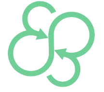
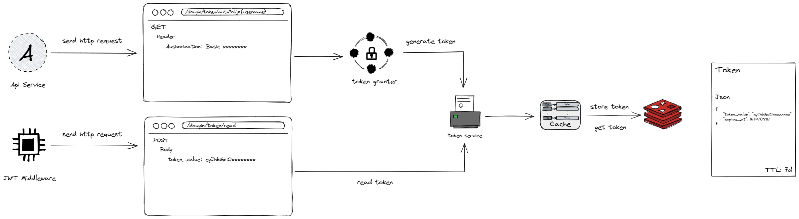
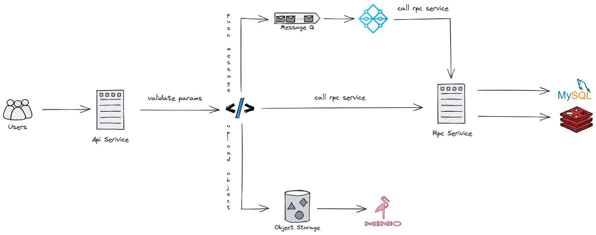
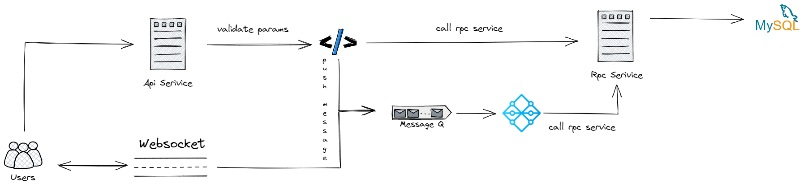

# 🎶 Douyin（第五届字节跳动青训营后端考核项目）

[](https://github.com/StellarisW/douyin)[](https://github.com/StellarisW/douyin)[](http://opentracing.io)

## 💡 项目简介

> 仓库: [https://github.com/StellarisW/Douyin]()

本项目完成了抖音的简单后端，主要实现了功能有：用户的注册与登录，视频feed流，视频投稿，用户关注，聊天等操作

## 🌟 项目特点

## 🚀 功能介绍

功能按照**系统（代码）架构**分类

## 📊 基准测试

## 🗼 项目设计

### 技术栈


- [apollo](https://www.apolloconfig.com/)

> 一款可靠的分布式配置管理中心，诞生于携程框架研发部，能够集中化管理应用不同环境、不同集群的配置，配置修改后能够实时推送到应用端，并且具备规范的权限、流程治理等特性，适用于微服务配置管理场景。

使用apollo做配置管理系统，可以有效的在认证系统，用户系统等等不同的环境下进行配置的管理


- [go-zero](https://go-zero.dev/)

> 一个集成了各种工程实践的包含 微服务框架。
>
> 它具有高性能（高并发支撑，自动缓存控制，自适应熔断，负载均衡）、易拓展（支持中间件，方便扩展，面向故障编程，弹性设计）、低门槛（大量微服务治理和并发工具包、goctl自动生成代码很香），

同时go-zero也是现在最流行的go微服务框架，所以本项目采用go-zero为主框架搭建后端


- [mysql](https://www.mysql.com/)

> 一个关系型数据库管理系统，由瑞典MySQL AB 公司开发，属于 Oracle 旗下产品。MySQL 是最流行的关系型数据库管理系统关系型数据库管理系统之一，在 WEB 应用方面，MySQL是最好的 RDBMS (Relational Database Management System，关系数据库管理系统) 应用软件之一

关系型数据库选型


- [minio](https://min.io/)

> `MinIO`是一个用`Golang`开发的基于`Apache License v2.0`开源协议的`高性能对象存储服务`。
>
> 它兼容亚马逊S3云存储服务接口，非常适合于存储大容量非结构化的数据，例如图片、视频、日志文件、备份数据和容器/虚拟机镜像等，而一个对象文件可以是任意大小，从几kb到最大5T不等。

本项目使用minio作为对象存储平台


- [nsq](https://nsq.io/)

>  Go 语言编写的开源分布式消息队列中间件，具备非常好的性能、易用性和可用性

​    刚开始想用RabbitMQ，但是很难做到集群和水平扩展，再看了看其他的队列组件（Darner，Redis，Kestrel和Kafka），每种队列组件都有不同的消息传输保     	证，但似乎并没有一种能在可扩展性和操作简易性上都比较优秀的产品。

​    然后就看到了nsq，支持横向拓展，性能也很好，同时也是go语言原生开发的，因此选型nsq



- [asynq](https://github.com/hibiken/asynq)

> go语言实现的高性能分布式任务队列和异步处理库，基于redis，类似sidekiq和celery

​	asynq是一个分布式延迟消息队列，本项目用它进行异步及定时任务处理


- [redis](https://redis.io/)

> 一个开源的、使用C语言编写的、支持网络交互的、可基于内存也可持久化的Key-Value数据库。

缓存存储还是选型最普遍的redis


- [consul](https://www.consul.io/)

> 一套开源的分布式服务发现和配置管理系统，由HasiCorp公司用go语言开发的。提供了微服务系统中服务助理、配置中心、控制总线等功能。

在consul和etcd之间比较，consul的服务发现很方便，也有健康检查，多数据中心等功能，同时也是go云原生项目，因此选型consul


- [jaeger](https://www.jaegertracing.io/)

> 由Uber开源的分布式追踪系统

go-zero框架集成了对jaeger的支持，因此使用jaeger做追踪系统


- [traefik](https://www.jaegertracing.io/)

> 一个为了让部署微服务更加便捷而诞生的现代HTTP反向代理、负载均衡工具。

本项目写的微服务很多，用nginx难管理，也比较懒得写配置文件，所以用traefik，虽然性能没nginx好，但是对微服务的反向代理和负载均衡的支持很便捷，

同时使用traefik中的http中间件，oauth proxy也很方便

### 架构图

[点击放大](./manifest/docs/image/architecture.svg)


### 目录结构

<details>
<summary>展开查看</summary>
<pre>
<code>
    ├── app -------------------------------------------- (项目文件)
        ├── common ------------------------------------- (全局通用目录)
        	├── config --------------------------------- (获取配置文件相关)
        		├── internal --------------------------- (配置组件内部包)
        			├── common ------------------------- (通用配置)
        			├── consts ------------------------- (配置组件常量定义)
        			├── database ----------------------- (数据库配置)
        			├── middleware --------------------- (中间件配置)
        			├── types -------------------------- (apollo, viper 对象)
        	├── douyin ---------------------------------- (本项目的通用常量和函数)
        	├── errx ----------------------------------- (错误包)
        	├── log ------------------------------------ (日志配置)
        	├── middleware ----------------------------- (中间件)
        	├── model ---------------------------------- (全局模型)
        ├── service ------------------------------------ (微服务)
            ├── auth ----------------------------------- (认证系统)
            	├── api -------------------------------- (api服务代码)
            		├── internal ----------------------- (api服务内部包)
            			├── config --------------------- (服务配置)
            			├── consts --------------------- (常量,包括错误逻辑id定义)
            			├── handler -------------------- (http handler)
            			├── logic ---------------------- (业务逻辑函数,被handler调用)
            			├── model ---------------------- (业务模型)
            				├── token ------------------ (令牌业务模型)
            			├── svc ------------------------ (服务上下文)
            			├── types ---------------------- (http请求结构体定义)
            	├── internal --------------------------- (认证系统内部包)
            		├── auth --------------------------- (系统业务逻辑相关公用的常量,结构体,函数)
            		├── sys ---------------------------- (系统相关的公用常量)
            	├── rpc -------------------------------- (rpc服务代码)
            		├── token -------------------------- (token类 rpc服务)
            			├── enhancer ------------------- (token-enhancer rpc服务)
            				├── internal --------------- (token-enhancer rpc服务内部包)
            					├── config ------------- (服务配置)
            					├── consts ------------- (常量,包括错误逻辑id定义)
            					├── logic -------------- (业务逻辑函数,被rpc调用)
            					├── model -------------- (业务模型)
            						├── jwt ------------ (jwt模型)
            					├── server ------------- (rpc调用函数)
            					├── svc ---------------- (服务上下文)
            				├── pb --------------------- (pb定义文件)
            				├── tokenenhancer ---------- (rpc服务调用)
            			├── store ---------------------- (token-store rpc服务)
            				├── internal --------------- (token-store rpc服务内部包)
            					├── config ------------- (服务配置)
            					├── consts ------------- (常量,包括错误逻辑id定义)
            					├── logic -------------- (业务逻辑函数,被rpc调用)
            					├── server ------------- (rpc调用函数)
            					├── svc ---------------- (服务上下文)
            				├── pb --------------------- (pb定义文件)
            				├── tokenstore ------------- (rpc服务调用)
            ├── chat ------------------------------ (聊天系统)
            	├── api -------------------------------- (api服务代码)
            		├── internal ----------------------- (api服务内部包)
            			├── config --------------------- (服务配置)
            			├── consts --------------------- (常量,包括错误id定义)
            			├── handler -------------------- (http handler)
            			├── logic ---------------------- (业务逻辑函数,被handler调用)
            			├── svc ------------------------ (服务上下文)
            			├── types ---------------------- (http请求结构体定义)
            	├── internal --------------------------- (聊天系统内部包)
            		├── char ---------------------- (系统业务逻辑相关公用的常量,结构体,函数)
            		├── sys ---------------------------- (系统相关的公用常量)
            	├── rpc -------------------------------- (rpc服务代码)
            		├── sys ---------------------------- (sys rpc 服务)
            			├── internal ------------------- (sys rpc 服务内部包)
            				├── config ----------------- (服务配置)
            				├── logic ------------------ (业务逻辑函数,被rpc调用)
            				├── model ------------------ (业务模型)
            					├── dao ---------------- (数据库模型)
            						├── entity --------- (数据库实体)
            				├── server ----------------- (rpc调用函数)
            				├── svc -------------------- (服务上下文)
            			├── pb ------------------------- (pb定义文件)
            			├── sys ------------------------ (rpc服务调用)
            ├── mq ----------------------------------- (消息队列系统)
            	├── nsq ------------------------------ (nsq 分布式消息队列)
            		├── consumer --------------------- (nsq 消费者)
            			├── internal ----------------- (nsq 消费者内部包)
            				├── config --------------- (服务配置)
            				├── listen --------------- (监听配置)
            					├── chat ------------- (聊天模块相关)
            					├── user ------------- (用户模块相关)
            					├── video ------------ (视频模块相关)
            				├── svc ------------------ (服务上下文)
            		├── internal --------------------- (nsq 内部包)
            			├── consts ------------------- (nsq 相关的公用常量)
            		├── producer --------------------- (nsq 生产者)
            			├── chat --------------------- (聊天模块相关)
            			├── user --------------------- (用户模块相关)
            			├── video -------------------- (视频模块相关)
            ├── user ----------------------------------- (用户系统)
            	├── api -------------------------------- (api服务代码)
            		├── internal ----------------------- (api服务内部包)
            			├── config --------------------- (服务配置)
            			├── consts --------------------- (常量,包括错误id定义)
            				├── profile ------------------- (个人信息业务相关逻辑)
            				├── relation ------------------ (关注业务相关逻辑)
            				├── sign ----------------- (注册登录业务相关逻辑)
            			├── handler -------------------- (http handler)
            			├── logic ---------------------- (业务逻辑函数,被handler调用)
            			├── svc ------------------------ (服务上下文)
            			├── types ---------------------- (http请求结构体定义)
            	├── internal --------------------------- (用户系统内部包)
            		├── sys ---------------------------- (系统相关的公用常量)
            		├── user --------------------------- (系统业务逻辑相关公用的常量,结构体,函数)
            	├── rpc -------------------------------- (rpc服务代码)
            		├── sys ---------------------------- (sys rpc 服务)
            			├── internal ------------------- (sys rpc 服务内部包)
            				├── config ----------------- (服务配置)
            				├── logic ------------------ (业务逻辑函数,被rpc调用)
            				├── model ------------------ (业务模型)
            					├── consts ------------- (常量,包括错误逻辑id定义)
            					├── dao ---------------- (数据库模型)
            						├── entity --------- (数据库实体)
            					├── profile --------------- (个人信息模型)
            					├── relation -------------- (关注模型)
            					├── sign ------------- (注册登录模型)
            			├── server --------------------- (rpc调用函数)
            			├── svc ------------------------ (服务上下文)
            		├── pb ----------------------------- (pb定义文件)
            		├── sys ---------------------------- (rpc服务调用)
            ├── video ----------------------------------- (聊天系统)
            	├── api -------------------------------- (api服务代码)
            		├── internal ----------------------- (api服务内部包)
            			├── config --------------------- (服务配置)
            			├── consts --------------------- (常量,包括错误id定义)
            				├── crud ------------------- (修改业务相关逻辑)
            				├── info ------------------- (查询业务相关逻辑)
            			├── handler -------------------- (http handler)
            			├── logic ---------------------- (业务逻辑函数,被handler调用)
            			├── svc ------------------------ (服务上下文)
            			├── types ---------------------- (http请求结构体定义)
            	├── internal --------------------------- (视频系统内部包)
            		├── sys ---------------------------- (系统相关的公用常量)
            		├── video --------------------------- (系统业务逻辑相关公用的常量,结构体,函数)
            	├── rpc -------------------------------- (rpc服务代码)
            		├── sys ---------------------------- (sys rpc 服务)
            			├── internal ------------------- (sys rpc 服务内部包)
            				├── config ----------------- (服务配置)
            				├── logic ------------------ (业务逻辑函数,被rpc调用)
            				├── model ------------------ (业务模型)
            					├── consts ------------- (常量,包括错误逻辑id定义)
            					├── crud --------------- (修改模型)
            					├── dao ---------------- (数据库模型)
            						├── entity --------- (数据库实体)
            					├── info --------------- (查询模型)
            			├── server --------------------- (rpc调用函数)
            			├── svc ------------------------ (服务上下文)
            		├── pb ----------------------------- (pb定义文件)
            		├── sys ---------------------------- (rpc服务调用)
    ├── manifest --------------------------------------- (交付清单)
    	├── .goctl ------------------------------------- (goctl模板)
    	├── docs --------------------------------------- (项目文档)
    	├── deploy ------------------------------------- (部署配置文件)
    		├── docker --------------------------------- (docker配置文件)
        ├── sql ---------------------------------------- (mysql初始化配置文件)
    ├── utils ------------------------------------------ (工具包) 
        ├── file --------------------------------------- (对文件操作的函数包)
        ├── redix -------------------------------------- (redis相关操作包)
</code>
</pre>
</details>


### 中间件设计

#### Sentinel 中间件

#### JWT 中间件

### 认证模块设计

#### 需求分析

该项目的接口除了用户注册、登录，及视频流接口外皆需要在query或form表单里面提供用户鉴权token，

所以该模块需要有两个功能：

- 在用户登录后给用户 **提供** 鉴权token，

- 根据在其他接口的JWT中间件中发送的请求中提供的token，**校验** token有效性及 **解析** 其中的用户信息

#### 架构设计



#### 令牌的颁发与校验

业务逻辑主要通过 **令牌颁发器接口** 和 **令牌服务接口** 实现

##### 令牌颁发器

```go
type (
	// TokenGranter 令牌颁发器接口
	TokenGranter interface {
		Grant(ctx context.Context, grantType string, auth string, obj string) (*auth.Token, errx.Error)
	}

	// ComposeTokenGranter 集成令牌颁发器
	ComposeTokenGranter struct {
		TokenGrantDict map[string]TokenGranter
	}

	// AuthorizationTokenGranter 通过认证令牌的颁发器结构体
	AuthorizationTokenGranter struct {
		SupportGrantType string
		ClientSecret     map[string]string
		TokenService     TokenService
	}
)
```

该接口只有一个方法 `Grant()` ，用来颁发令牌，

目前只有 **Authorization** 一种认证方式，该接口的好处是具有良好的扩展性，方便以后拓展 **Oauth2 登录**等多种登录认证方式

参数说明：

- **granType**：颁发类型

    目前有以下类型：

    - **Authorization**：根据Basic Auth头颁发令牌

- **auth**：认证参数

- **obj**：颁发对象

##### 令牌服务

```go
type (
	// TokenService 令牌服务接口
	TokenService interface {
		GenerateToken(ctx context.Context, subject string, audience string) (*auth.Token, errx.Error)
		ReadToken(ctx context.Context, tokenValue string) (string, errx.Error)
	}

	// DefaultTokenService 默认令牌服务结构体
	DefaultTokenService struct {
	}

	// RpcTokenService rpc 令牌服务结构体
	RpcTokenService struct {
		TokenEnhancerClient tokenenhancer.TokenEnhancer
	}
)
```

该接口共有两种方法：`GenerateToken()` 用来颁发令牌，`ReadToken()`用来读取令牌

该接口通过调用 `TokenEnhancerClient` Rpc服务实现业务逻辑

#### 令牌设计

##### jwt 设计

本项目 jwt 通过 [jwx](https://github.com/lestrrat-go/jwx) 实现

- **header**

    Header 部分是一个 JSON 对象，描述 JWT 的元数据

    ```json
    {
      "typ": "JWT", // 令牌类型
      "alg": "HS256" // 加密算法
    }
    ```

- **payload**

    Payload 部分也是一个 JSON 对象，用来存放实际需要传递的数据

    因为 JWT 默认是不加密的，所以本项目使用 `PBES2_HS512_A256KW` 加密算法将 payload 加密后再进行签名操作

    ```json
    {
      "iss": "douyin.xxx.com", // 签发人
      "iat": 1516239022, // 签发时间
      "sub": "StellarisW", // 主题
      "aud": "douyin.xxx.com", // 受众
      "nbf": 1516239022, // 生效时间
      "exp": 1516339022 // 过期时间
    }
    ```

- **signature**

    Signature 部分是对前两部分的签名，防止数据篡改。

    首先，需要指定一个密钥（secret）。这个密钥只有服务器才知道，不能泄露给用户。

    然后，使用 Header 里面指定的签名算法（本项目使用 HMAC SHA256），按照下面的公式产生签名

    算出签名以后，把 Header、Payload、Signature 三个部分拼成一个字符串，每个部分之间用"点"（`.`）分隔，就可以返回给用户

    ```
    HMACSHA256(
      base64UrlEncode(header) + "." +
      base64UrlEncode(payload), 
    )
    ```

##### 结构体 设计

```go
type Token struct {
	TokenValue string `json:"token_value,omitempty"` // 令牌值
	ExpiresAt  int64  `json:"expires_at,omitempty"`  // 过期时间 (unix)
}
```

##### 生成令牌方法

```GO
// GenerateToken 生成授权令牌
func GenerateToken(subject string, audience string, scope string) (*auth.Token, errx.Error) {
	// 解析授权令牌有效时间
	accessTokenValidityTime, _ := time.ParseDuration(cast.ToString(auth.ClientDetails[audience].AccessTokenValidityTime))

	now := time.Now()

	// 构建授权令牌
	accessToken, err := jwt.NewBuilder().
		Issuer(issuer).
		IssuedAt(now).
		Subject(subject).
		Audience([]string{audience}).
		NotBefore(now.Truncate(time.Second)).
		Expiration(now.Add(accessTokenValidityTime)).
		Claim("scope", scope).
		Build()
	if err != nil {
		return nil, errTokenBuild
	}

	// 将授权令牌进行加密签名
	serializedAccessToken, err := jwt.NewSerializer().
		Encrypt(jwt.WithKey(jwa.PBES2_HS512_A256KW, encryptKey)).
		Sign(jwt.WithKey(jwa.HS256, signingKey)).
		Serialize(accessToken)
	if err != nil {
		return nil, errTokenSerialize
	}

	accessTokenValue := string(serializedAccessToken)

	return &auth.Token{
		TokenValue: accessTokenValue,
		ExpiresAt:  accessToken.Expiration().Unix(),
	}, nil
}
```

##### 解析令牌方法

```go
// ParseToken 解析令牌
func ParseToken(tokenValue string) (string, errx.Error) {
	var tokenBytes []byte

	// 验证令牌是否有效
	payload, err := jws.Verify([]byte(tokenValue), jws.WithKey(jwa.HS256, signingKey))
	if err != nil {
		return "", errInvalidSignature
	}

	// 将令牌载荷解密
	decrypted, err := jwe.Decrypt(payload, jwe.WithKey(jwa.PBES2_HS512_A256KW, encryptKey))
	if err != nil {
		return "", errInvalidKey
	}

	tokenBytes = decrypted

	payloadJson := gjson.ParseBytes(tokenBytes)

	if time.Now().Unix() <= payloadJson.Get("nbf").Int() {
		return "", errTokenNotValidYet
	}

	if time.Now().Unix() > payloadJson.Get("exp").Int() {
		return "", errTokenExpired
	}

	return string(tokenBytes), nil
}
```

#### 令牌存储

颁发令牌时先检测redis中有无现存的令牌，这样可以避免重复颁发令牌，

此外，后续可以根据该功能实现的令牌的黑名单功能

##### 缓存设计

- key：`auth:oauth2_token:{obj}`

- value：

    ```json
    {
        "token_value": "eyJhbGciOiJIUzI1NiIsImN0eSI6IkpXVCJ9.ZXlKaGJHY2lPaUpRUWtWVE1pMUlVelV4TWl0Qk1qVTJTMWNpTENKbGJtTWlPaUpCTWpVMlIwTk5JaXdpY0RKaklqb3hNREF3TUN3aWNESnpJam9pZUVGclYwcEhkR3BwTVU1TlZHOURVMk16VW05c2FtWkZTSEF3UkVnNU9EZFVTekJFVVRZeGVWZ3ljeUlzSW5SNWNDSTZJa3BYVkNKOS5WMURrR2daWGhzbTJrTDg5bVFpNmZpTk1qeUdpUEVLMG90RU82a2xCQ3BaLWNrMkJFRTZlNUEuNXBHLW1rSXlmQ0tQSTh5ai4wUU8xSkRja19ka2I4YVVSUVU3aE5fV1NlUmJuSmJscldPSERTWWVXLTRka2JrcTFobHZZSFhlVFhDNEhPUUVDak1FSEdwYmM2aXRKT2ZJWDhtQTBZLWVQQVJwX2ZuVXVseDhlSl9EOVo0NnlXOVRlcG94WGtlVHpIQ0VZMm9JWmRmRGVEbUNMY0FtT1FYVjZMd3oxZTY1WmhURmhPdTNSVDJJcExnaEczaTBwU0t1djBkazFySEJVMGgxQ3BPWWRvaGtVMEEuV1N1UDVlaXhES0lYRXdaQlNHMEc4Zw.XPNcH7ItFYahj6cd7YegdzYGThvZ3aiqpcE-m74Y2Ls",
        "expires_at": 1674708117
    }
    ```

- TTL：7d

### 用户模块设计

#### 需求分析

本模块包括用户注册与登录、用户信息和用户关注操作三个部分

##### 用户注册与登录

- `/douyin/user/register` - **用户注册接口**

    新用户注册时提供用户名，密码，昵称即可，用户名需要保证唯一。创建成功后返回用户 id 和权限token

    ```go
    type (
    	RegisterReq {
    		Username string `form:"username"` // 注册用户名，最长32个字符
    		Password string `form:"password"` // 密码，最长32个字符
    	}
    	RegisterRes {
    		StatusCode uint32 `json:"status_code"` // 状态码，0-成功，其他值-失败
    		StatusMsg  string `json:"status_msg"` // 返回状态描述
    		UserId     int64  `json:"user_id,omitempty"` // 用户id
    		Token      string `json:"token,omitempty"` // 用户鉴权token
    	}
    )
    ```

- `/douyin/user/login` - **用户登录接口**

    通过用户名和密码进行登录，登录成功后返回用户 id 和权限 token.

    ```go
    type (
    	LoginReq {
    		Username string `form:"username"` // 登录用户名
    		Password string `form:"password"` // 密码
    	}
    	LoginRes {
    		StatusCode uint32 `json:"status_code"` // 状态码，0-成功，其他值-失败
    		StatusMsg  string `json:"status_msg"` // 返回状态描述
    		UserId     int64  `json:"user_id,omitempty"` // 用户id
    		Token      string `json:"token,omitempty"` // 用户鉴权token
    	}
    )
    ```

##### 用户信息

- /`douyin/user` - **用户信息**

    获取登录用户的 id、昵称，如果实现社交部分的功能，还会返回关注数和粉丝数。

    ```go
    type (
    	GetProfileReq {
    		UserId string `form:"user_id"` // 用户id
    		Token  string `form:"token"` // 用户鉴权token
    	}
    	GetProfileRes {
    		StatusCode uint32   `json:"status_code"` // 状态码，0-成功，其他值-失败
    		StatusMsg  string   `json:"status_msg"` // 返回状态描述
    		User       *Profile `json:"user,omitempty"` // 用户信息
    	}
    )
    
    type (
    	Profile {
    		Id            int64  `json:"id"` // 用户id
    		Name          string `json:"name"` // 用户名称
    		FollowCount   int64  `json:"follow_count"` // 关注总数
    		FollowerCount int64  `json:"follower_count"` // 粉丝总数
    		IsFollow      bool   `json:"is_follow"` // true-已关注，false-未关注
    	}
    )
    ```

##### 用户关注

- `/douyin/relation` - **关系操作**

    实现用户之间的关注关系维护，登录用户能够关注或取关其他用户，同时自己能够看到自己关注过的所有用户列表，以及所有关注自己的用户列表。

    ```go
    type (
    	RelationReq {
    		Token      string `form:"token"` // 用户鉴权token
    		ToUserId   string `form:"to_user_id"` // 对方用户id
    		ActionType string `form:"action_type"` // 1-关注，2-取消关注
    	}
    	RelationRes {
    		StatusCode uint32 `json:"status_code"` // 状态码，0-成功，其他值-失败
    		StatusMsg  string `json:"status_msg"` // 返回状态描述
    	}
    )
    ```

- `/douyin/relation/follow/list` - **用户关注列表**

    登录用户关注的所有用户列表。

    ```go
    type (
    	GetFollowListReq {
    		UserId string `form:"user_id"` // 用户id
    		Token  string `form:"token"` // 用户鉴权token
    	}
    	GetFollowListRes {
    		StatusCode uint32      `json:"status_code"` // 状态码，0-成功，其他值-失败
    		StatusMsg  string      `json:"status_msg"` // 返回状态描述
            UserList   interface{} `json:"user_list,omitempty"` // 用户信息列表, interface{} = GetFollowListRes.Profile
    	}
    )
    ```

    ```protobuf
    message GetFollowListReq{
        int64 src_user_id=1;
        int64 dst_user_id=2;
    }
    message GetFollowListRes{
        uint32 status_code = 1;
        string status_msg = 2;
        repeated Profile user_list=3;
    }
    
    message Profile{
        int64 id=1; // 用户id
        string name=2; // 用户名称
        int64 follow_count=3; // 关注总数
        int64 follower_count=4; // 粉丝总数
        bool is_follow=5; // true-已关注，false-未关注
    }
    ```
- `/douyin/relation/follower/list` - **用户粉丝列表**

    所有关注登录用户的粉丝列表。

      ```go
      type (
      	GetFollowerListReq {
      		UserId string `form:"user_id"` // 用户id
      		Token  string `form:"token"` // 用户鉴权token
      	}
      	GetFollowerListRes {
      		StatusCode uint32      `json:"status_code"` // 状态码，0-成功，其他值-失败
      		StatusMsg  string      `json:"status_msg"` // 返回状态描述
      		UserList   interface{} `json:"user_list,omitempty"` // 用户列表, interface{} = GetFollowerListRes.Profile
      	}
      )
      ```

    ```protobuf
    message GetFollowerListReq{
        int64 src_user_id=1;
        int64 dst_user_id=2;
    }
    message GetFollowerListRes{
        uint32 status_code = 1;
        string status_msg = 2;
        repeated Profile user_list=3;
    }
    
    message Profile{
        int64 id=1; // 用户id
        string name=2; // 用户名称
        int64 follow_count=3; // 关注总数
        int64 follower_count=4; // 粉丝总数
        bool is_follow=5; // true-已关注，false-未关注
    }
    ```
- `/douyin/relation/friend/list` - **用户好友列表**

    所有关注登录用户的粉丝列表。

    ```go
    type (
    	GetFriendListReq {
    		UserId string `form:"user_id"` // 用户id
    		Token  string `form:"token"` // 用户鉴权token
    	}
    	GetFriendListRes {
    		StatusCode uint32      `json:"status_code"` // 状态码，0-成功，其他值-失败
    		StatusMsg  string      `json:"status_msg"` // 返回状态描述
    		UserList   interface{} `json:"user_list,omitempty"` // 用户列表, interface{} = GetFriendListRes.Profile
    	}
    )
    ```

    ```protobuf
    message GetFriendListReq{
        int64 src_user_id=1;
        int64 dst_user_id=2;
    }
    message GetFriendListRes{
        uint32 status_code = 1;
        string status_msg = 2;
        repeated Profile user_list=3;
    }
    
    message Profile{
        int64 id=1; // 用户id
        string name=2; // 用户名称
        int64 follow_count=3; // 关注总数
        int64 follower_count=4; // 粉丝总数
        bool is_follow=5; // true-已关注，false-未关注
    }
    ```

#### 架构设计


#### 接口设计

##### 用户注册与登录


### 视频模块设计

本模块包括视频的获取与投稿、视频喜欢和视频评论三个部分

#### 需求分析

##### 视频的获取与投稿

- `/douyin/feed` - **视频流接口**

    不限制登录状态，返回按投稿时间倒序的视频列表，视频数由服务端控制，单次最多30个。
    
    ```go
    type (
    	FeedReq {
    		LastestTime string `form:"latest_time,optional"` // 可选参数，限制返回视频的最新投稿时间戳，精确到秒，不填表示当前时间
    		Token       string `form:"token,optional"` // 可选参数，登录用户设置
    	}
    	FeedRes {
    		StatusCode uint32      `json:"status_code"` // 状态码，0-成功，其他值-失败
    		StatusMsg  string      `json:"status_msg"` // 返回状态描述
    		NextTime   int64       `json:"next_time,omitempty"` // 本次返回的视频中，发布最早的时间，作为下次请求时的latest_time
            VideoList  interface{} `json:"video_list,omitempty"` // 视频列表, interface{} = FeedRes.Videos
    	}
    )
    ```
    
    ```protobuf
    message FeedReq{
        int64 latest_time=1;
        int64 user_id=2;
    }
    message FeedRes{
        uint32 status_code = 1;
        string status_msg = 2;
        repeated Video videos = 3;
        int64 next_time=4;
    }
    
    message Video{
        int64 id=1; // 视频唯一标识
        Profile user=2; // 视频作者信息
        string play_url=3; // 视频播放地址
        string cover_url=4; // 视频封面地址
        int64 favorite_count=5; // 视频的点赞总数
        int64 comment_count=6; // 视频的评论总数
        bool is_favorite=7; // true-已点赞，false-未点赞
        string title=8; // 视频标题
    }
    ```

- `/douyin/publish/action` - **视频投稿**

    登录用户选择视频上传。

    ```go
    type (
    	PublishReq {
    		Token string `form:"token"` // 用户鉴权token
            Data os.File `form:"data"` // 视频数据
    		Title string `form:"title"` // 视频标题
    	}
    	PublishRes {
    		StatusCode uint32 `json:"status_code"` // 状态码，0-成功，其他值-失败
    		StatusMsg  string `json:"status_msg"` // 返回状态描述
    	}
    )
    ```

##### 视频喜欢

- `/douyin/favorite/action` - **赞操作**

    ```go
    type (
    	FavoriteReq {
    		Token      string `form:"token"` // 用户鉴权token
    		VideoId    string `form:"video_id"` // 视频id
    		ActionType string `form:"action_type"` // 1-点赞，2-取消点赞
    	}
    	FavoriteRes {
    		StatusCode uint32 `json:"status_code"` // 状态码，0-成功，其他值-失败
    		StatusMsg  string `json:"status_msg"` // 返回状态描述
    	}
    )
    ```

- `/douyin/favorite/list` - **喜欢列表**

    ```go
    type (
    	GetFavoriteListReq {
    		UserId string `form:"user_id"` // 用户id
    		Token  string `form:"token"` // 用户鉴权token
    	}
    	GetFavoriteListRes {
    		StatusCode uint32      `json:"status_code"` // 状态码，0-成功，其他值-失败
    		StatusMsg  string      `json:"status_msg"` // 返回状态描述
            VideoList  interface{} `json:"video_list,omitempty"` // 用户点赞视频列表, interface{} = GetfavoriteListRes.Videos
    	}
    )
    ```

    ```protobuf
    message GetFavoriteListReq{
        int64 src_user_id=1;
        int64 dst_user_id=2;
    }
    message GetFavoriteListRes{
        uint32 status_code = 1;
        string status_msg = 2;
        repeated Video videos = 3;
    }
    
    message Video{
        int64 id=1; // 视频唯一标识
        Profile user=2; // 视频作者信息
        string play_url=3; // 视频播放地址
        string cover_url=4; // 视频封面地址
        int64 favorite_count=5; // 视频的点赞总数
        int64 comment_count=6; // 视频的评论总数
        bool is_favorite=7; // true-已点赞，false-未点赞
        string title=8; // 视频标题
    }
    message Profile{
        int64 id=1; // 用户id
        string name=2; // 用户名称
        int64 follow_count=3; // 关注总数
        int64 follower_count=4; // 粉丝总数
        bool is_follow=5; // true-已关注，false-未关注
    }
    ```

##### 视频评论

- `/douyin/comment/action` - **评论操作**

    ```go
    type (
    	CommentReq {
    		Token       string `form:"token"` // 用户鉴权token
    		VideoId     string `form:"video_id"` // 视频id
    		ActionType  string `form:"action_type"` // 1-发布评论，2-删除评论
    		CommentText string `form:"comment_text,optional"` // 用户填写的评论内容，在action_type=1的时候使用
    		CommentId   string `form:"comment_id,optional"` // 要删除的评论id，在action_type=2的时候使用
    	}
    	CommentRes {
    		StatusCode uint32      `json:"status_code"` // 状态码，0-成功，其他值-失败
    		StatusMsg  string      `json:"status_msg"` // 返回状态描述
            Comment    interface{} `json:"comment,omitempty"` // 评论成功返回评论内容，不需要重新拉取整个列表, interface{} = CommentRes.Comment
    	}
    )
    ```

    ```protobuf
    message CommentReq{
        int64 user_id=1;
        int64 video_id=2;
        uint32 action_type=3;
        string comment_text=4;
        int64 comment_id=5;
    }
    message CommentRes{
        uint32 status_code = 1;
        string status_msg = 2;
        Comment comment = 3;
    }
    
    message Comment{
        int64 id=1; // 视频评论id
        Profile user=2; // 评论用户信息
        string content=3; // 评论内容
        string create_date=4; // 评论发布日期，格式 mm-dd
    }
    message Profile{
        int64 id=1; // 用户id
        string name=2; // 用户名称
        int64 follow_count=3; // 关注总数
        int64 follower_count=4; // 粉丝总数
        bool is_follow=5; // true-已关注，false-未关注
    }
    ```

- `/douyin/comment/list` - **视频评论列表**

    ```go
    type (
    	GetCommentListReq {
    		Token   string `form:"token"` // 用户鉴权token
    		VideoId string `form:"video_id"` // 视频id
    	}
    	GetCommentListRes {
    		StatusCode  uint32      `json:"status_code"` // 状态码，0-成功，其他值-失败
    		StatusMsg   string      `json:"status_msg"` // 返回状态描述
            CommentList interface{} `json:"comment_list,omitempty"` // 评论列表, interface{} = GetCommentListRes.Comments
    	}
    )
    ```

    ```protobuf
    message GetCommentListReq{
        int64 user_id=1;
        int64 video_id=2;
    }
    message GetCommentListRes{
        uint32 status_code = 1;
        string status_msg = 2;
        repeated Comment comments = 3;
    }
    
    message Comment{
        int64 id=1; // 视频评论id
        Profile user=2; // 评论用户信息
        string content=3; // 评论内容
        string create_date=4; // 评论发布日期，格式 mm-dd
    }
    message Profile{
        int64 id=1; // 用户id
        string name=2; // 用户名称
        int64 follow_count=3; // 关注总数
        int64 follower_count=4; // 粉丝总数
        bool is_follow=5; // true-已关注，false-未关注
    }
    ```

#### 架构设计



### 聊天模块设计

本模块有发送消息和获取消息两个操作

#### 需求分析

- `/douyin/message/action` - **消息操作**

    ```go
    type (
    	SendMessageReq {
    		Token      string `form:"token"` // 用户鉴权token
    		ToUserId   string `form:"to_user_id"` // 对方用户id
    		ActionType string `form:"action_type"` // 1-发送消息
    		Content    string `form:"content,optional"` // 消息内容
    	}
    	SendMessageRes {
    		StatusCode uint32 `json:"status_code"` // 状态码，0-成功，其他值-失败
    		StatusMsg  string `json:"status_msg"` // 返回状态描述
    	}
    )
    ```

- `/douyin/message/chat` - **聊天记录**

    ```go
    type (
    	GetMessageListReq {
    		Token    string `form:"token"` // 用户鉴权token
    		ToUserId string `form:"to_user_id"` // 对方用户id
    	}
    	GetMessageListRes {
    		StatusCode  uint32      `json:"status_code"` // 状态码，0-成功，其他值-失败
    		StatusMsg   string      `json:"status_msg"` // 返回状态描述
            MessageList interface{} `json:"message_list,omitempty"` // 消息列表, interface{} = GetMessageRes.Messages
    	}
    )
    ```

    ```protobuf
    message GetMessageReq{
        int64 src_user_id=1;
        int64 dst_user_id=2;
    }
    message GetMessageRes{
        uint32 status_code=1;
        string status_msg=2;
        repeated Message messages = 3;
    }
    
    message Message{
        int64 id=1; // 消息id
        string content=2; // 消息内容
        string create_time=3; // 消息创建时间
    }
    ```

#### 架构设计



## 🛠 开发准备

## 📌 TODO

- [ ] 缓存
- [ ] 视频截图作为视频封面

## 🎈 贡献者

- [StellarisW](https://github.com/StellarisW)

- [Snluna](https://github.com/Snluna)

## 🎗鸣谢

- [字节跳动青训营](https://youthcamp.bytedance.com/)


## 改进点

- 考虑到接口文档限制，没有做分页处理