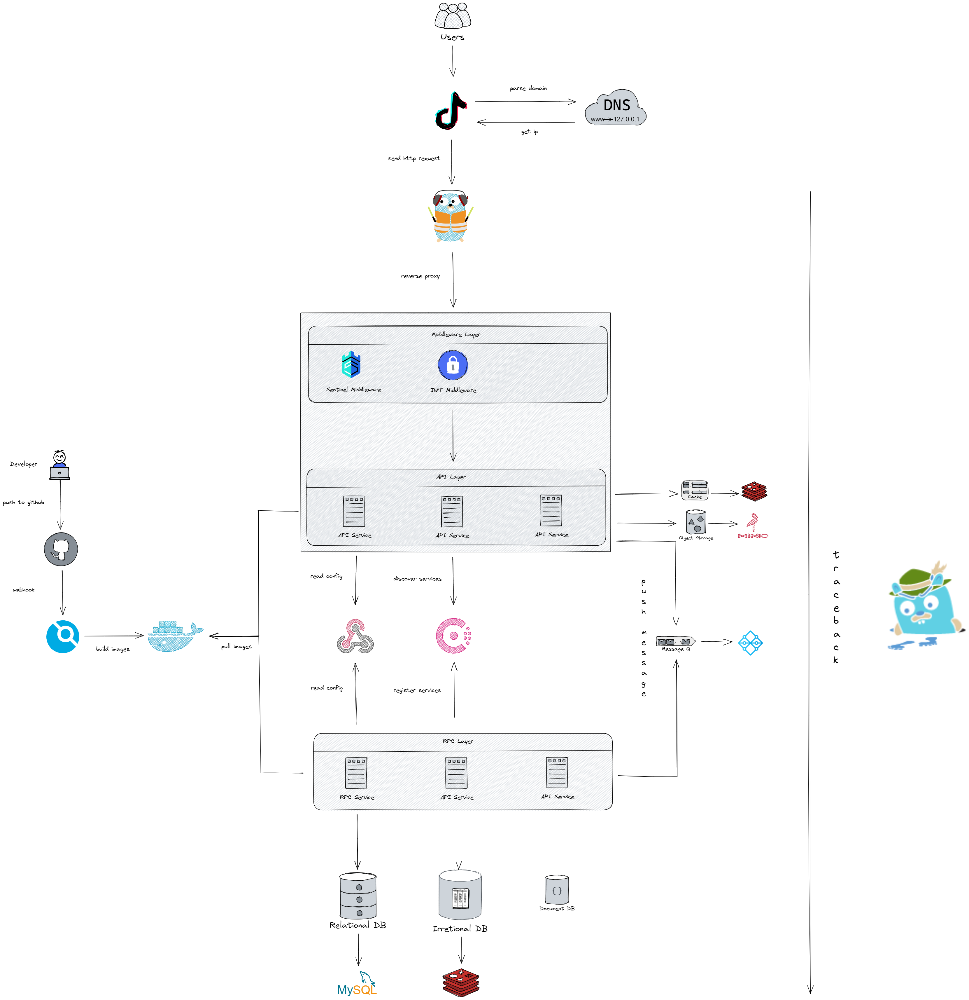
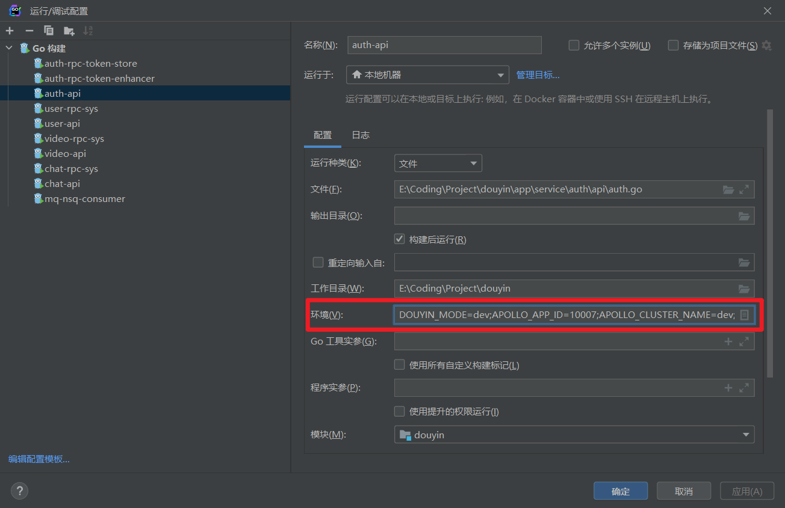

# 🎶 Douyin（第五届字节跳动青训营后端考核项目）

[](https://github.com/StellarisW/douyin)[](https://github.com/StellarisW/douyin)[](http://opentracing.io)

## 💡 项目简介

> 仓库: [https://github.com/StellarisW/Douyin]()

本项目完成了抖音的简单后端，主要实现了功能有：用户的注册与登录，视频feed流，视频投稿，用户关注，聊天等操作

## 🌟 项目特点

### ⚙️ 易维护

- **架构高度工程化**

​		设计了最合适的代码架构，对业务开发友好，封装复杂度，以便代码的快速迭代

- **代码生成工具**

    自定义代码生成模板，以适配本项目的需求

- **全局错误码定义**

    为代码的每个逻辑定义的特定的错误码，可以在前端获取错误码即可定位错误来源

- **日志组件**

    实现日志全覆盖

- **配置组件**

    使用 apollo 配置管理平台，能进行灰度发布，分环境、分集群管理配置

- **链路追踪**

    使用 Jaeger 进行链路追踪，查看请求的全链路，确定其各个部分的耗时以及错误来源

### ✅ 高可用

- **弹性设计，面向故障编程**

    以面向故障的思维方式编程，考虑到不同的级别的故障或者问题，有效保障了业务的连续性，持续性

- **限流，提供过载保护**

    通过判断特定条件来确定是否执行某个策略，只处理自己能力范围之内的请求，超量的请求会被限流。

- **熔断，提供过载保护**

    负载超过系统的承载能力时，系统会自动采取保护措施，立即中断服务，确保自身不被压垮。

- **集群化部署**

    Api 服务宕机后 自动恢复，Rpc 服务进行集群部署，避免单点

    数据库使用 TiDB 集群（待配置），缓存使用 Redis 集群，消息队列使用 nsq 集群，对象存储平台使用 minio 集群

### 📊 高并发

- **服务负载均衡**

    将rpc服务集群化部署，然后 consul 进行负载均衡，服务器压力过大时，可以实现轻松水平扩展

- **消息队列**

    使用消息队列，将业务异步处理，进行流量削峰

- **进程共享调用**

    相同的多个请求只需要发起一次拿结果的调用，其他请求"坐享其成"，有效减少了资源服务的并发压力，可以有效防止缓存击穿。

### ⚡ 高性能

- **缓存支持**

    在api层使用缓存，提高数据读取速度

- **map reduce**

    使用并发处理，降低需要多个服务依赖等业务逻辑的耗时

- **并发优化**

    如用户信息、视频信息的拼装使用协程加速拼装速度

- **特定业务逻辑使用算法优化**

    如用户关系计算使用集合操作

### 🔋 安全可靠

- **用户密码加密**

    将密码进行哈希操作后存储到数据库

- **加密JWT**

    将JWT进行加密，防止篡改

- **严密的的边界情况处理**

    考虑的用户可能输入的边界情况，进行特殊的处理

## 🚀 功能介绍

功能按照**系统（代码）架构**分类

- **认证模块**

    - JWT 颁发
    - JWT 校验

- **用户模块**

    - 用户的注册与登录
    - 获取用户信息
    - 关注用户
    - 获取用户的关注、粉丝和好友列表

- **视频模块**

    - 视频feed流
    - 视频投稿
    - 视频点赞
    - 视频评论
    - 获取视频投稿列表
    - 获取视频点赞列表
    - 获取视频评论列表

- **聊天模块**

    支持消息的发送与获取，目前支持以下两种方式：

    - 轮询 http 接口
    - Websocet 保持用户长连接

## 📊 基准测试

## 🗼 项目设计

### 技术栈


- [apollo](https://www.apolloconfig.com/)

> 一款可靠的分布式配置管理中心，诞生于携程框架研发部，能够集中化管理应用不同环境、不同集群的配置，配置修改后能够实时推送到应用端，并且具备规范的权限、流程治理等特性，适用于微服务配置管理场景。

使用apollo做配置管理系统，可以有效的在认证系统，用户系统等等不同的环境下进行配置的管理


- [go-zero](https://go-zero.dev/)

> 一个集成了各种工程实践的包含 微服务框架。
>
> 它具有高性能（高并发支撑，自动缓存控制，自适应熔断，负载均衡）、易拓展（支持中间件，方便扩展，面向故障编程，弹性设计）、低门槛（大量微服务治理和并发工具包、goctl自动生成代码很香），

同时go-zero也是现在最流行的go微服务框架，所以本项目采用go-zero为主框架搭建后端


- [mysql](https://www.mysql.com/)

> 一个关系型数据库管理系统，由瑞典MySQL AB 公司开发，属于 Oracle 旗下产品。MySQL 是最流行的关系型数据库管理系统关系型数据库管理系统之一，在 WEB 应用方面，MySQL是最好的 RDBMS (Relational Database Management System，关系数据库管理系统) 应用软件之一

关系型数据库选型


- [minio](https://min.io/)

> `MinIO`是一个用`Golang`开发的基于`Apache License v2.0`开源协议的`高性能对象存储服务`。
>
> 它兼容亚马逊S3云存储服务接口，非常适合于存储大容量非结构化的数据，例如图片、视频、日志文件、备份数据和容器/虚拟机镜像等，而一个对象文件可以是任意大小，从几kb到最大5T不等。

本项目使用minio作为对象存储平台


- [nsq](https://nsq.io/)

>  Go 语言编写的开源分布式消息队列中间件，具备非常好的性能、易用性和可用性

​    刚开始想用RabbitMQ，但是很难做到集群和水平扩展，再看了看其他的队列组件（Darner，Redis，Kestrel和Kafka），每种队列组件都有不同的消息传输保     	证，但似乎并没有一种能在可扩展性和操作简易性上都比较优秀的产品。

​    然后就看到了nsq，支持横向拓展，性能也很好，同时也是go语言原生开发的，因此选型nsq


- [redis](https://redis.io/)

> 一个开源的、使用C语言编写的、支持网络交互的、可基于内存也可持久化的Key-Value数据库。

缓存存储还是选型最普遍的redis


- [consul](https://www.consul.io/)

> 一套开源的分布式服务发现和配置管理系统，由HasiCorp公司用go语言开发的。提供了微服务系统中服务助理、配置中心、控制总线等功能。

在consul和etcd之间比较，consul的服务发现很方便，也有健康检查，多数据中心等功能，同时也是go云原生项目，因此选型consul


- [jaeger](https://www.jaegertracing.io/)

> 由Uber开源的分布式追踪系统

go-zero框架集成了对jaeger的支持，因此使用jaeger做追踪系统


- [traefik](https://www.jaegertracing.io/)

> 一个为了让部署微服务更加便捷而诞生的现代HTTP反向代理、负载均衡工具。

本项目写的微服务很多，用nginx难管理，也比较懒得写配置文件，所以用traefik，虽然性能没nginx好，但是对微服务的反向代理和负载均衡的支持很便捷，

同时使用traefik中的http中间件，oauth proxy也很方便

### 架构图

[点击放大](./manifest/docs/image/architecture.svg)



### 目录结构

<details>
<summary>展开查看</summary>
<pre>
<code>
    ├── app --------------------------------------------- (项目文件)
        ├── common -------------------------------------- (全局通用目录)
        	├── config ---------------------------------- (获取配置文件相关)
        		├── internal ---------------------------- (配置组件内部包)
        			├── common -------------------------- (通用配置)
        			├── consts -------------------------- (配置组件常量定义)
        			├── database ------------------------ (数据库配置)
        			├── middleware ---------------------- (中间件配置)
        			├── types --------------------------- (apollo, viper 对象)
        	├── douyin ---------------------------------- (本项目的通用常量和函数)
        	├── errx ------------------------------------ (错误包)
        	├── log ------------------------------------- (日志配置)
        	├── middleware ------------------------------ (中间件)
        	├── model ----------------------------------- (全局模型)
        ├── service ------------------------------------- (微服务)
            ├── auth ------------------------------------ (认证系统)
            	├── api --------------------------------- (api服务代码)
            		├── internal ------------------------ (api服务内部包)
            			├── config ---------------------- (服务配置)
            			├── consts ---------------------- (常量,包括错误逻辑id定义)
            			├── handler --------------------- (http handler)
            			├── logic ----------------------- (业务逻辑函数,被handler调用)
            			├── model ----------------------- (业务模型)
            				├── token ------------------- (令牌业务模型)
            			├── svc ------------------------- (服务上下文)
            			├── types ----------------------- (http请求结构体定义)
            	├── internal ---------------------------- (认证系统内部包)
            		├── auth ---------------------------- (系统业务逻辑相关公用的常量,结构体,函数)
            		├── sys ----------------------------- (系统相关的公用常量)
            	├── rpc --------------------------------- (rpc服务代码)
            		├── token --------------------------- (token类 rpc服务)
            			├── enhancer -------------------- (token-enhancer rpc服务)
            				├── internal ---------------- (token-enhancer rpc服务内部包)
            					├── config -------------- (服务配置)
            					├── consts -------------- (常量,包括错误逻辑id定义)
            					├── logic --------------- (业务逻辑函数,被rpc调用)
            					├── model --------------- (业务模型)
            						├── jwt ------------- (jwt模型)
            					├── server -------------- (rpc调用函数)
            					├── svc ----------------- (服务上下文)
            				├── pb ---------------------- (pb定义文件)
            				├── tokenenhancer ----------- (rpc服务调用)
            			├── store ----------------------- (token-store rpc服务)
            				├── internal ---------------- (token-store rpc服务内部包)
            					├── config -------------- (服务配置)
            					├── consts -------------- (常量,包括错误逻辑id定义)
            					├── logic --------------- (业务逻辑函数,被rpc调用)
            					├── server -------------- (rpc调用函数)
            					├── svc ----------------- (服务上下文)
            				├── pb ---------------------- (pb定义文件)
            				├── tokenstore -------------- (rpc服务调用)
            ├── chat ------------------------------------ (聊天系统)
            	├── api --------------------------------- (api服务代码)
            		├── internal ------------------------ (api服务内部包)
            			├── config ---------------------- (服务配置)
            			├── consts ---------------------- (常量,包括错误id定义)
            			├── handler --------------------- (http handler)
            			├── logic ----------------------- (业务逻辑函数,被handler调用)
            			├── svc ------------------------- (服务上下文)
            			├── types ----------------------- (http请求结构体定义)
            			├── ws -------------------------- (socket 客户端)
            				├── internal ---------------- (socket 内部包)
            					├── client -------------- (用户客户端)
            					├── config -------------- (socket 设置)
            					├── model --------------- (消息模型)
            						├── request --------- (请求消息模型)
            						├── response -------- (相应消息模型)
            					├── service ------------- (ws服务)
            						├── listen ---------- (监听配置)
            							├── internal ---- (服务内部包)
	            							├── handler - (ws协议升级)
            						├── manager --------- (连接池管理)
            					├── svc ----------------- (服务上下文)
            	├── internal ---------------------------- (聊天系统内部包)
            		├── char ---------------------------- (系统业务逻辑相关公用的常量,结构体,函数)
            		├── sys ----------------------------- (系统相关的公用常量)
            	├── rpc --------------------------------- (rpc服务代码)
            		├── sys ----------------------------- (sys rpc 服务)
            			├── internal -------------------- (sys rpc 服务内部包)
            				├── config ------------------ (服务配置)
            				├── logic ------------------- (业务逻辑函数,被rpc调用)
            				├── model ------------------- (业务模型)
            					├── dao ----------------- (数据库模型)
            						├── entity ---------- (数据库实体)
            				├── server ------------------ (rpc调用函数)
            				├── svc --------------------- (服务上下文)
            			├── pb -------------------------- (pb定义文件)
            			├── sys ------------------------- (rpc服务调用)
            ├── mq -------------------------------------- (消息队列系统)
            	├── nsq --------------------------------- (nsq 分布式消息队列)
            		├── consumer ------------------------ (nsq 消费者)
            			├── internal -------------------- (nsq 消费者内部包)
            				├── config ------------------ (服务配置)
            				├── listen ------------------ (监听配置)
            					├── chat ---------------- (聊天模块相关)
            					├── user ---------------- (用户模块相关)
            					├── video --------------- (视频模块相关)
            				├── svc --------------------- (服务上下文)
            		├── internal ------------------------ (nsq 内部包)
            			├── consts ---------------------- (nsq 相关的公用常量)
            		├── producer ------------------------ (nsq 生产者)
            			├── chat ------------------------ (聊天模块相关)
            			├── user ------------------------ (用户模块相关)
            			├── video ----------------------- (视频模块相关)
            ├── user ------------------------------------ (用户系统)
            	├── api --------------------------------- (api服务代码)
            		├── internal ------------------------ (api服务内部包)
            			├── config ---------------------- (服务配置)
            			├── consts ---------------------- (常量,包括错误id定义)
            				├── profile ----------------- (个人信息业务相关逻辑)
            				├── relation ---------------- (关注业务相关逻辑)
            				├── sign -------------------- (注册登录业务相关逻辑)
            			├── handler --------------------- (http handler)
            			├── logic ----------------------- (业务逻辑函数,被handler调用)
            			├── svc ------------------------- (服务上下文)
            			├── types ----------------------- (http请求结构体定义)
            	├── internal ---------------------------- (用户系统内部包)
            		├── sys ----------------------------- (系统相关的公用常量)
            		├── user ---------------------------- (系统业务逻辑相关公用的常量,结构体,函数)
            	├── rpc --------------------------------- (rpc服务代码)
            		├── sys ----------------------------- (sys rpc 服务)
            			├── internal -------------------- (sys rpc 服务内部包)
            				├── config ------------------ (服务配置)
            				├── logic ------------------- (业务逻辑函数,被rpc调用)
            				├── model ------------------- (业务模型)
            					├── consts -------------- (常量,包括错误逻辑id定义)
            					├── dao ----------------- (数据库模型)
            						├── entity ---------- (数据库实体)
            					├── profile ------------- (个人信息模型)
            					├── relation ------------ (关注模型)
            					├── sign ---------------- (注册登录模型)
            			├── server ---------------------- (rpc调用函数)
            			├── svc ------------------------- (服务上下文)
            		├── pb ------------------------------ (pb定义文件)
            		├── sys ----------------------------- (rpc服务调用)
            ├── video ----------------------------------- (聊天系统)
            	├── api --------------------------------- (api服务代码)
            		├── internal ------------------------ (api服务内部包)
            			├── config ---------------------- (服务配置)
            			├── consts ---------------------- (常量,包括错误id定义)
            				├── crud -------------------- (修改业务相关逻辑)
            				├── info -------------------- (查询业务相关逻辑)
            			├── handler --------------------- (http handler)
            			├── logic ----------------------- (业务逻辑函数,被handler调用)
            			├── svc ------------------------- (服务上下文)
            			├── types ----------------------- (http请求结构体定义)
            	├── internal ---------------------------- (视频系统内部包)
            		├── sys ----------------------------- (系统相关的公用常量)
            		├── video --------------------------- (系统业务逻辑相关公用的常量,结构体,函数)
            	├── rpc --------------------------------- (rpc服务代码)
            		├── sys ----------------------------- (sys rpc 服务)
            			├── internal -------------------- (sys rpc 服务内部包)
            				├── config ------------------ (服务配置)
            				├── logic ------------------- (业务逻辑函数,被rpc调用)
            				├── model ------------------- (业务模型)
            					├── consts -------------- (常量,包括错误逻辑id定义)
            					├── crud ---------------- (修改模型)
            					├── dao ----------------- (数据库模型)
            						├── entity ---------- (数据库实体)
            					├── info ---------------- (查询模型)
            			├── server ---------------------- (rpc调用函数)
            			├── svc ------------------------- (服务上下文)
            		├── pb ------------------------------ (pb定义文件)
            		├── sys ----------------------------- (rpc服务调用)
    ├── manifest ---------------------------------------- (交付清单)
    	├── .goctl -------------------------------------- (goctl模板)
    	├── config -------------------------------------- (项目配置)
    		├── dict ------------------------------------ (文本过滤字典)
    	├── deploy -------------------------------------- (部署配置文件)
    		├── image ----------------------------------- (项目基础镜像)
    			├── base -------------------------------- (基础镜像)
    			├── ffmpeg ------------------------------ (带ffmpeg的基础镜像)
    		├── docker ---------------------------------- (docker配置文件)
        ├── sql ----------------------------------------- (mysql初始化配置文件)
    	├── docs ---------------------------------------- (项目文档)
    		├── image ----------------------------------- (文档图片)
    ├── utils ------------------------------------------- (工具包) 
        ├── file ---------------------------------------- (对文件操作的函数包)
        ├── redix --------------------------------------- (redis相关操作包)
</code>
</pre>
</details>


### 中间件设计

- **Sentinel 中间件**

- **JWT 中间件**

### 模块设计

[认证模块](manifest/docs/auth.md)

[用户模块](manifest/docs/user.md)

[视频模块](manifest/docs/video.md)

[聊天模块](manifest/docs/chat.md)

## 📝 项目文档

[项目接口文档](https://console-docs.apipost.cn/preview/0dbc4952baaa3637/3e218dda8575c1bd)

[青训营抖音项目方案说明](https://bytedance.feishu.cn/docs/doccnKrCsU5Iac6eftnFBdsXTof#)

[青训营官方抖音项目接口说明文档](https://www.apifox.cn/apidoc/shared-09d88f32-0b6c-4157-9d07-a36d32d7a75c/api-50707523)

## 🛠 开发准备

为了开发过程中方便本地调试，需要作出一下准备

### 添加hosts

因为服务内部之间会使用http互相通信，如：

```go
func (m *DefaultModel) getToken(ctx context.Context, userId int64) (string, errx.Error) {
	authRes, err := req.NewRequest().
		SetHeader("Authorization", m.AuthString).
		SetQueryParam("obj", strconv.FormatInt(userId, 10)).
		Get("http://douyin-auth-api:11120/douyin/token/auth")
    ...
}
```

同时也方便使用接口测试工具进行本地调试，需要添加以下hosts

```
127.0.0.1 douyin-auth-api
127.0.0.1 douyin-uesr-api
127.0.0.1 douyin-video-api
127.0.0.1 douyin-chat-api
```

### 添加环境变量

#### 运行模式

**环境变量名**：DOUYIN_MODE

**环境变量值**：

```go
const (
	ModeEnvName = "DOUYIN_MODE"
	DevMode     = "dev" // 开发环境, 后端人员使用
	FatMode     = "fat" // 功能验收测试环境, 前端人员使用
	UatMode     = "uat" // 用户验收测试环境, 模拟上线环境
	ProMode     = "pro" // 生产环境, 正式环境
)
```

### 配置管理

因为本项目**配置信息**的读取高度依赖 **apollo**，所以你如果想要**本地运行(调试)**项目文件请在 `运行/调试配置` 中添加以下**环境变量**

- APOLLO_APP_ID
- APOLLO_CLUSTER_NAME
- APOLLO_IP
- APOLLO_SECRET



### CI 平台

平台使用drone进行项目的自动构建

构建配置见 [.drone.yml](.drone.yml)

## 📌 TODO

- [ ] 考虑到接口文档限制，没有做分页处理

## 🎈 贡献者

- [StellarisW](https://github.com/StellarisW)

- [Snluna](https://github.com/Snluna)

## 🎗鸣谢

- [字节跳动青训营](https://youthcamp.bytedance.com/)
