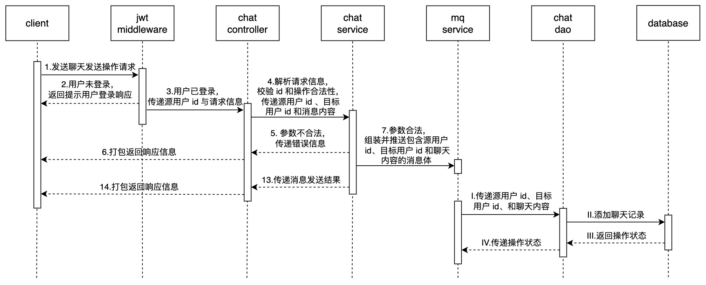

## 架构设计

<div style="text-align: center">

</div>

## 接口设计

### 聊天消息

#### 消息发送

##### 需求分析

- `/douyin/message/action` - **消息操作**

    ```go
    type (
    	SendMessageReq {
    		Token      string `form:"token"` // 用户鉴权token
    		ToUserId   string `form:"to_user_id"` // 对方用户id
    		ActionType string `form:"action_type"` // 1-发送消息
    		Content    string `form:"content,optional"` // 消息内容
    	}
    	SendMessageRes {
    		StatusCode uint32 `json:"status_code"` // 状态码，0-成功，其他值-失败
    		StatusMsg  string `json:"status_msg"` // 返回状态描述
    	}
    )
    ```

##### 基本流程

已登录用户可以发送聊天消息给其他用户。

1. 用户在客户端中其他用户个人主页点击发起聊天按钮进入聊天界面，在文本框中输入消息点击发送按钮，客户端**向服务端发起发送消息请求**

2. 服务端接收请求，首先**对发起请求的用户信息进行鉴权**。

    ​	若未登录，则返回请先登录提示信息

    ​	若已登录，则校验用户 ID 和视频 ID 合法性、关系操作合法性。

    ​		若不合法，则返回 ID 或操作不合法提示信息

    ​		若合法，则**对聊天消息内容进行敏感词过滤**，生成过滤后新的聊天内容，打包由 socket 客户端发送给 socket 服务端

3. 结合 ID、操作和聊天内容组装聊天消息体**推送至消息队列**，并返回包含操作状态的响应信息

4. 消息队列的 consumer 不断取出操作消息体，在数据库和缓存中进行操作

5. 客户端接收请求，在页面显示已发送聊天内容

<div style="text-align: center">

</div>

<div style="text-align: center">

</div>

#### 消息列表

##### 需求分析

- `/douyin/message/chat` - **聊天记录**

    ```go
    type (
    	GetMessageListReq {
    		Token    string `form:"token"` // 用户鉴权token
    		ToUserId string `form:"to_user_id"` // 对方用户id
    	}
    	GetMessageListRes {
    		StatusCode  uint32      `json:"status_code"` // 状态码，0-成功，其他值-失败
    		StatusMsg   string      `json:"status_msg"` // 返回状态描述
            MessageList interface{} `json:"message_list,omitempty"` // 消息列表, interface{} = GetMessageRes.Messages
    	}
    )
    ```

    ```protobuf
    message GetMessageReq{
        int64 src_user_id=1;
        int64 dst_user_id=2;
    }
    message GetMessageRes{
        uint32 status_code=1;
        string status_msg=2;
        repeated Message messages = 3;
    }
    
    message Message{
        int64 id=1; // 消息id
        string content=2; // 消息内容
        string create_time=3; // 消息创建时间
    }
    ```

##### 基本流程

已登录用户可以查看自己与其他用户的聊天消息列表。

1. 用户在客户端中其他用户个人主页点击发起聊天按钮，客户端向服务端**发送消息列表查询请求**

2. 服务端接收请求，首先**对发起请求的用户信息进行鉴权**。

    ​	若未登录，则返回请先登录提示信息

    ​	若已登录，则校验用户 ID 和视频 ID 合法性、关系操作合法性。

    ​		若不合法，则返回 ID 或操作不合法提示信息

    ​		若合法，则在数据库中**查询相应的聊天消息**，并返回包含列表信息数据的响应信息

3. 客户端接收响应信息，在聊天页面显示列表信息

<div style="text-align: center">

</div>

<div style="text-align: center">

</div>

## 设计亮点

- **过滤敏感词**

    过滤聊天敏感信息，原理见 [go-sensitive](https://github.com/StellarisW/go-sensitive)

    ```go
    func (l *CommentLogic) Comment(req *types.CommentReq) (resp *types.CommentRes, err error) {
        ...
    	err = video.Comment(producer, video.CommentMessage{
    		UserId:      userId,
    		VideoId:     videoId,
    		ActionType:  uint32(actionType),
    		CommentText: l.svcCtx.Filter.GetFilter().Replace(req.CommentText, '*'),
    		CommentId:   commentId,
    	})
        ...
    }
    ```
- **消息队列**

    将数据推送至消息队列，异步返回数据
- **websocket**

    socket client 进行消息的推送与接收，同时将消息发送给指定 socket client 后调用 rpc 服务进行消息数据的持久化

    ws 服务维护了一个连接池，服务会将长时间闲时的连接断开，支持保持大量长连接

## 参考文档

[golang基于websocket单台机器支持百万连接分布式聊天(IM)系统](https://github.com/link1st/gowebsocket#7%E5%A6%82%E4%BD%95%E5%9F%BA%E4%BA%8EwebSocket%E5%AE%9E%E7%8E%B0%E4%B8%80%E4%B8%AA%E5%88%86%E5%B8%83%E5%BC%8FIm)