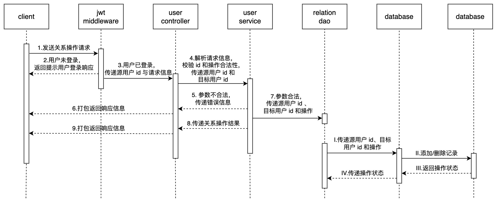

## 架构设计


## 接口设计

### 用户注册与登录

#### 用户注册

##### 需求分析

- `/douyin/user/register` - **用户注册接口**

    新用户注册时提供用户名，密码，昵称即可，用户名需要保证唯一。创建成功后返回用户 id 和权限token

    ```go
    type (
    	RegisterReq {
    		Username string `form:"username"` // 注册用户名，最长32个字符
    		Password string `form:"password"` // 密码，最长32个字符
    	}
    	RegisterRes {
    		StatusCode uint32 `json:"status_code"` // 状态码，0-成功，其他值-失败
    		StatusMsg  string `json:"status_msg"` // 返回状态描述
    		UserId     int64  `json:"user_id,omitempty"` // 用户id
    		Token      string `json:"token,omitempty"` // 用户鉴权token
    	}
    )
    ```

##### 基本流程

1. 用户在客户端注册页面**输入用户名和密码**，点击注册按钮，客户端向服务端发起注册请求
2. 服务端接收请求，首先**校验用户名和密码的合法性**。若不合法，则返回用户名或密码不合法提示信息
3. 若合法，则**在数据库中查询是否存在相同用户名的用户信息**。

    ​	若存在，则返回用户已存在提示信息

    ​	若不存在，则生成用户 ID，在加密密码后向数据库中添加用户信息，并基于当前时间戳生成用户信息 token，返回包含用户 ID 和 token 信息的响应信息
4. 客户端接收响应信息，切换至登录状态


##### 亮点

- **校验入参**

    通过正则表达式校验用户名、密码格式

    ```go
    func NewServiceContext(c config.Config) *ServiceContext {
        ...
    	// 4到32位(字母,数字,下划线,减号)
    	usernameReg := regexp2.MustCompile(`^[a-zA-Z0-9_-]{4,32}$`, regexp2.None)
    	// 5-32位(包括至少1个大写字母,1个小写字母,1个数字)
    	passwordRes := regexp2.MustCompile(`^(?=.*\d)(?=.*[a-z])(?=.*[A-Z])[a-zA-Z0-9]{5,32}$`, regexp2.None)
    	...
    }
    
    func (l *RegisterLogic) Register(req *types.RegisterReq) (resp *types.RegisterRes, err error) {
        ...
    	if ok, err := l.svcCtx.Regexp.UsernameReg.MatchString(req.Username); !ok || err != nil {
    		return &types.RegisterRes{
    			StatusCode: errx.Encode(
    				errx.Logic,
    				sys.SysId,
    				douyin.Api,
    				sys.ServiceIdApi,
    				consts.ErrIdLogicSign,
    				sign.ErrIdOprRegister,
    				sign.ErrIdInvalidUsername,
    			),
    			StatusMsg: sign.ErrInvalidUsername,
    		}, nil
    	}
    
    	if ok, err := l.svcCtx.Regexp.PasswordReg.MatchString(req.Password); !ok || err != nil {
    		return &types.RegisterRes{
    			StatusCode: errx.Encode(
    				errx.Logic,
    				sys.SysId,
    				douyin.Api,
    				sys.ServiceIdApi,
    				consts.ErrIdLogicSign,
    				sign.ErrIdOprRegister,
    				sign.ErrIdInvalidUsername,
    			),
    			StatusMsg: sign.ErrInvalidPassword,
    		}, nil
    	}
        ...
    }
    
    ```

- **用户密码加密**

    通过 `sha256`  算法对用户密码进行哈希，避免数据库中存储明文密码

    ```go
    func encryptPassword(password string) string {
    	d := sha3.Sum224([]byte(password))
    	return hex.EncodeToString(d[:])
    }
    ```

- **注册缓存**

    添加注册缓存，判断用户是否存在，防止大量恶意请求造成缓存穿透

    注册时如果用户存在则返回错误，登录时如果用户不存在则返回错误

    ```go
    func (m *DefaultModel) Register(ctx context.Context, username, password string) (int64, string, errx.Error) {
        ...
        // 添加注册缓存
    	err = m.rdb.SAdd(ctx,
    		user.RdbKeyRegisterSet,
    		username).Err()
    	if err != nil {
    		log.Logger.Error(errx.RedisSet, zap.Error(err))
    		return 0, "", errRedisSet
    	}
    	...
    }
    
    func (l *RegisterLogic) Register(req *types.RegisterReq) (resp *types.RegisterRes, err error) {
    	...
        // 注册时判断用户是否存在, 若存在则返回错误
    	isExist, err := l.svcCtx.Rdb.SIsMember(l.ctx,
    		user.RdbKeyRegisterSet,
    		req.Username).Result()
    	if err != nil {
    		log.Logger.Error(errx.RedisGet, zap.Error(err))
    		return &types.RegisterRes{
    			StatusCode: errx.Encode(
    				errx.Sys,
    				sys.SysId,
    				douyin.Api,
    				sys.ServiceIdApi,
    				consts.ErrIdLogicSign,
    				sign.ErrIdOprRegister,
    				sign.ErrIdRedisGet,
    			),
    			StatusMsg: errx.Internal,
    		}, nil
    	}
    	if isExist {
    		return &types.RegisterRes{
    			StatusCode: errx.Encode(
    				errx.Logic,
    				sys.SysId,
    				douyin.Api,
    				sys.ServiceIdApi,
    				consts.ErrIdLogicSign,
    				sign.ErrIdOprRegister,
    				sign.ErrIdUsernameExist,
    			),
    			StatusMsg: sign.ErrUsernameExist,
    		}, nil
    	}
    	...
    }
    
    func (l *LoginLogic) Login(req *types.LoginReq) (resp *types.LoginRes, err error) {
    	...
        // 登录时判断用户是否存在, 若不存在则返回错误
    	isExist, err := l.svcCtx.Rdb.SIsMember(l.ctx,
    		user.RdbKeyRegisterSet,
    		req.Username).Result()
    	if err != nil {
    		log.Logger.Error(errx.RedisGet, zap.Error(err))
    		return &types.LoginRes{
    			StatusCode: errx.Encode(
    				errx.Sys,
    				sys.SysId,
    				douyin.Api,
    				sys.ServiceIdApi,
    				consts.ErrIdLogicSign,
    				sign.ErrIdOprLogin,
    				sign.ErrIdRedisGet,
    			),
    			StatusMsg: errx.Internal,
    		}, nil
    	}
    	if !isExist {
    		return &types.LoginRes{
    			StatusCode: errx.Encode(
    				errx.Logic,
    				sys.SysId,
    				douyin.Api,
    				sys.ServiceIdApi,
    				consts.ErrIdLogicSign,
    				sign.ErrIdOprLogin,
    				sign.ErrIdUsernameNotExist,
    			),
    			StatusMsg: sign.ErrUsernameNotExist,
    		}, nil
    	}
    	...
    }
    ```

#### 用户登录

##### 需求分析

- `/douyin/user/login` - **用户登录接口**

    通过用户名和密码进行登录，登录成功后返回用户 id 和权限 token.

    ```go
    type (
    	LoginReq {
    		Username string `form:"username"` // 登录用户名
    		Password string `form:"password"` // 密码
    	}
    	LoginRes {
    		StatusCode uint32 `json:"status_code"` // 状态码，0-成功，其他值-失败
    		StatusMsg  string `json:"status_msg"` // 返回状态描述
    		UserId     int64  `json:"user_id,omitempty"` // 用户id
    		Token      string `json:"token,omitempty"` // 用户鉴权token
    	}
    )
    ```

##### 基本流程

1. 用户在客户端登录页面**输入用户名和密码**，点击登录按钮，客户端向服务端发起登录请求
2. 服务端接收请求，首先**校验用户名和密码的合法性**。

    ​	若不合法，则返回用户名或密码不合法提示信息

    ​	若合法，则在对密码加密后在数据库和缓存中查询是否存在相应用户信息。

    ​		若不存在，则返回用户名或密码错误提示信息

    ​		若存在，则基于当前时间戳生成新的用户信息 token，并**返回包含用户 ID 和 token 信息的响应信息**
3. 客户端接收响应信息，切换至登录状态


##### 亮点

- **登录次数限制**

    如果出现密码输入错误多次，会进行用户登录冻结，防止恶意爆破用户密码

    ```go
    func (m *DefaultModel) Login(ctx context.Context, username, password string) (int64, string, errx.Error) {
        ...
    	// 查看账户登录次数
    	cnt, err := m.rdb.Get(ctx,
    		user.RdbKeyLoginFrozenLoginCnt+username).Int64()
    	if err != nil {
    		if err != redis.Nil {
    			log.Logger.Error(errx.RedisGet, zap.Error(err))
    			return 0, "", errRedisGet
    		}
    	} else {
    		if cnt > 10 {
    			// 短时间内登录大于10次则冻结
    			lastFrozenTime, err := m.rdb.Get(ctx,
    				user.RdbKeyLoginFrozenTimeLast+username).Result()
    			if err != nil {
    				if err != redis.Nil {
    					log.Logger.Error(errx.RedisGet, zap.Error(err))
    					return 0, "", errRedisGet
    				}
    			}
    				var lastDuration time.Duration
    			var currentDuration time.Duration
    			switch lastFrozenTime {
    			case "":
    				lastDuration, _ = time.ParseDuration("1s")
    				currentDuration, _ = time.ParseDuration("1m")
    			case "1s":
    				lastDuration, _ = time.ParseDuration("1m")
    				currentDuration, _ = time.ParseDuration("15m")
    			case "1m":
    				lastDuration, _ = time.ParseDuration("15m")
    				currentDuration, _ = time.ParseDuration("1h")
    			case "15m":
    				lastDuration, _ = time.ParseDuration("1h")
    				currentDuration, _ = time.ParseDuration("24h")
    			case "1h":
    				lastDuration, _ = time.ParseDuration("24h")
    				currentDuration, _ = time.ParseDuration("168h")
    			case "1d":
    				lastDuration, _ = time.ParseDuration("168h")
    				currentDuration, _ = time.ParseDuration("720h")
    			case "7d":
    				lastDuration = -1
    				currentDuration = -1
    			}
    				err = m.rdb.Set(ctx,
    				user.RdbKeyLoginFrozenTimeLast+username,
    				1,
    				lastDuration).Err()
    			if err != nil {
    				log.Logger.Error(errx.RedisGet, zap.Error(err))
    				return 0, "", errRedisGet
    			}
    				err = m.rdb.Set(ctx,
    				user.RdbKeyLoginFrozenTime+username,
    				1,
    				currentDuration).Err()
    			if err != nil {
    				log.Logger.Error(errx.RedisSet, zap.Error(err))
    				return 0, "", errRedisSet
    			}
    				err = m.rdb.Del(ctx,
    				user.RdbKeyLoginFrozenLoginCnt+username).Err()
    			if err != nil {
    				log.Logger.Error(errx.RedisDel, zap.Error(err))
    				return 0, "", errRedisDel
    			}
    		}
    	}
    	// 登录次数增加一次
    	cnt, err = m.rdb.Incr(ctx,
    		user.RdbKeyLoginFrozenLoginCnt+username).Result()
    	if err != nil {
    		log.Logger.Error(errx.RedisIncr, zap.Error(err))
    		return 0, "", errRedisIncr
    	} else {
    		if cnt == 1 {
    			m.rdb.Expire(ctx,
    				user.RdbKeyLoginFrozenLoginCnt+username,
    				time.Minute*15)
    		}
    	}
        ...
    }
    
    func (l *LoginLogic) Login(req *types.LoginReq) (resp *types.LoginRes, err error) {
    	...
    	// 查看用户是否被冻结
    	frozenTime, err := l.svcCtx.Rdb.TTL(l.ctx,
    		user.RdbKeyLoginFrozenTime+req.Username).Result()
    	if err != nil {
    		log.Logger.Error(errx.RedisGet, zap.Error(err))
    		return &types.LoginRes{
    			StatusCode: errx.Encode(
    				errx.Sys,
    				sys.SysId,
    				douyin.Api,
    				sys.ServiceIdApi,
    				consts.ErrIdLogicSign,
    				sign.ErrIdOprLogin,
    				sign.ErrIdRedisGet,
    			),
    			StatusMsg: errx.Internal,
    		}, nil
    	} else {
    		if frozenTime.String() != "-2ns" {
    			return &types.LoginRes{
    				StatusCode: errx.Encode(
    					errx.Logic,
    					sys.SysId,
    					douyin.Api,
    					sys.ServiceIdApi,
    					consts.ErrIdLogicSign,
    					sign.ErrIdOprLogin,
    					sign.ErrIdLoginFrozen,
    				),
    				StatusMsg: fmt.Sprintf("%s, remain: %s", sign.ErrLoginFrozen, frozenTime.String()),
    			}, nil
    		}
    	}
        ...
    }
    ```

### 用户信息

#### 用户信息获取

##### 需求分析

- /`douyin/user` - **用户信息**

    获取登录用户的 id、昵称，如果实现社交部分的功能，还会返回关注数和粉丝数。

    ```go
    type (
    	GetProfileReq {
    		UserId string `form:"user_id"` // 用户id
    		Token  string `form:"token"` // 用户鉴权token
    	}
    	GetProfileRes {
    		StatusCode uint32   `json:"status_code"` // 状态码，0-成功，其他值-失败
    		StatusMsg  string   `json:"status_msg"` // 返回状态描述
    		User       *Profile `json:"user,omitempty"` // 用户信息
    	}
    )
    
    type (
    	Profile {
    		Id            int64  `json:"id"` // 用户id
    		Name          string `json:"name"` // 用户名称
    		FollowCount   int64  `json:"follow_count"` // 关注总数
    		FollowerCount int64  `json:"follower_count"` // 粉丝总数
    		IsFollow      bool   `json:"is_follow"` // true-已关注，false-未关注
    	}
    )
    ```
    
    ```protobuf
    message GetFollowListReq{
        int64 src_user_id=1;
            int64 dst_user_id=2;
    }
    message GetFollowListRes{
        uint32 status_code = 1;
        string status_msg = 2;
        repeated Profile user_list=3;
    }
        
    message Profile{
        int64 id=1; // 用户id
        string name=2; // 用户名称
        int64 follow_count=3; // 关注总数
        int64 follower_count=4; // 粉丝总数
        bool is_follow=5; // true-已关注，false-未关注
    }
    ```

##### 基本流程

**已登录用户**可以点击个人主页查看用户个人信息，也可以在视频页面点击作者头像进入其他人个人主页查看用户信息。

1. 用户在客户端**进入个人主页**，客户端向服务端发起用户信息获取请求

2. 客户端接收请求，首先**解析源用户 ID 和目标用户 ID**，并进行校验。

    ​	若不合法，则返回 ID 不合法提示信息

    ​	若合法，则先在数据库中根据目标用 ID 查询目标用户是否存在。

    ​		若不存在，则返回目标用户不存在提示信息

    ​		若存在，则在数据库和缓存中查询目标用户的关注数和粉丝数，并查询当前用户和目标用户的关注关系，返回包含以上信息的响应

3. 客户端接收响应，在个人主页显示用户信息


##### 亮点

- **MapReduce**

    用户信息包含关注数，粉丝数，是否关注，这三个信息需要查询在 redis 中的三个 key，可以使用 MapReduce 同时查询 keys，降低串行依赖产生的额外耗时

    
    
    ```go
    func (m *DefaultModel) GetProfile(ctx context.Context, srcUserId, dstUserId int64) (*pb.Profile, errx.Error) {
    	...
    	err := mr.Finish(func() error {
    		err := m.db.WithContext(ctx).
    			Select("`id`, `username`").
    			Where("`id` = ?", dstUserId).
    			Take(userSubject).
    			Error
    		if err != nil {
    			if err == gorm.ErrRecordNotFound {
    				return errUserNotFound
    			}
    			log.Logger.Error(errx.MysqlGet, zap.Error(err))
    			return errMysqlGet
    		}
    
    		return nil
    	}, func() error {
    		var err error
    		followCnt, err = m.rdb.ZCard(ctx, fmt.Sprintf("%s%d", user.RdbKeyFollow, dstUserId)).Result()
    		if err != nil {
    			log.Logger.Error(errx.RedisGet, zap.Error(err))
    			return errRedisGet
    		}
    
    		return nil
    	}, func() error {
    		var err error
    		followerCnt, err = m.rdb.ZCard(ctx, fmt.Sprintf("%s%d", user.RdbKeyFollower, dstUserId)).Result()
    		if err != nil {
    			log.Logger.Error(errx.RedisGet, zap.Error(err))
    			return errRedisGet
    		}
    
    		return nil
    	}, func() error {
    		var err error
    		_, err = m.rdb.ZRank(ctx, fmt.Sprintf("%s%d", user.RdbKeyFollow, srcUserId), strconv.FormatInt(dstUserId, 10)).Result()
    		if err != nil {
    			if err != redis.Nil {
    				log.Logger.Error(errx.RedisGet, zap.Error(err))
    				return errRedisGet
    			}
    		} else {
    			isFollow = true
    		}
    
    		return nil
    	})
    	if err != nil {
    		return nil, errx.New(errx.GetCode(err), err.Error())
    	}
        ...
    }
    ```

### 用户关注

#### 用户关系实现方案

在微博中，每一个用户都会有一个关注列表，一个粉丝列表。用户可以查看自己的关注，粉丝列表，也可以查看别人的关注，粉丝列表。并且，要展示列表里每个人与当前查看者的关注状态，一共有如下四种状态：

- 关注
- 粉丝
- 双向关注(互粉)
- 无关系

那么针对这些关系有常见的以下几个需求:

1. 查看某个用户的关注列表.
2. 查看某个用户的粉丝列表.
3. 查看某个人的好友（互关）列表
4. 判断两个用户之间的关系（是否已关注）
5. 获取两个人的共同关注

##### 关系型数据库实现

这个就比较简单了,将`关注`这一个关系作为一种实体存储下来.数据表结构(follow)如下:

| id   | src_user_id | dst_user_id | ts   |
| :--- | :---------- | :---------- | :--- |
| 1    | A           | B           | time |
| 2    | B           | C           | time |
| 3    | A           | C           | time |

这种存储在功能上市勉强可以实现的.

1. **查看用户的关注列表**

    ```sql
    select to_uid from follow where from_uid = 'A' order by ts
    ```

    可以拿到用户A的关注列表,按照时间关注的时间进行排序.

2. **查看用户的粉丝列表**

    ```sql
    select from_uid from follow where to_uid = 'C' order by ts
    ```

    可以拿到用户C的粉丝列表,根据关注的时间进行排序.

3. **查询用户的好友列表**

    ```sql
    select to_uid from follow where to_uid in (select from_uid from follow where to_uid= 'A') and and from_uid = 'A'

​		进行了一次子查询且语句中有in,当数据量稍大的时候查询效果太差劲了.

使用MySQL当然是可以实现的,而且查询的复杂性还不是最难搞的问题.

难搞的是,当数据量直线上升,使用mysql就必须要进行分库分表,这时候分表的策略就很难定了.

使用`follow表的id`来进行分表,那么久意味着对每一个用户的关注或者粉丝查询都需要从多个表查到数据再进行聚合,这个操作不科学.

使用uid进行分表,就意味着有数据冗余,且没有办法避免热点数据问题,比如微博很多大v有几千万的粉丝,这些数据放在一张表中仍然很拥挤,而且这样分表,表的数量会很多。

针对以上问题，还是推崇使用 redis 中的 hash 结构来存储关系数据

##### redis 实现

###### 数据结构设计

每个用户对应两个 hash 表，一个存储该用户的关注列表，一个存储改用户的粉丝列表

还是上面数据表格中的三条数据,存储在redis中表现为：

`user:relation:follow:A` -> `B,C`

`user:relation:follower:A` -> `null`

`user:relation:follow:B` -> `C`

`user:relation:follower:B` -> `A`

`user:relation:follow:C` -> `null`

`user:relation:follower:C` -> `A,B`

此外,还可以使用`sorted set` 来实现,将关注或者粉丝的 id 放在 set 中,将其关注时间作为分值,这样也可以获取到一个有序的关注列表.

###### 关系计算

**集合关系图**：


如上图所示。左边的圆表示用户的关注列表，右边的圆表示粉丝列表，下边的圆表示的是要查看的列表(集合)。分别用`follow`，`follower`，`find`来表明这三个集合。

本项目的需求分两种情况来看：

- **看自己的关注、粉丝和好友列表**

    这种情况相对简单一点。比如看自己的关注列表，列表里的人的与自己的关系状态不可能是“无关系”和“粉丝”。只可能是“关注”和“双向关注”。同样，粉丝列表也只有两种状态。

    当查看自己的列表时，其实表示find集合是上面集合中某一个的子集。

    例如查看自己的关注，此时find是follow的子集，

    查看自己粉丝，此时`find`是`follower`的子集，

    因为本项目没有分页查询，所以此时`find`是等同于`follow`或者`follower`的

- **看别人的关注、粉丝和好友列表**

    这是最复杂的情况，假如看别人关注列表，列表里的人和自己可能有上述全部四种关系状态。

    查看别人的列表时，此时图中产生了三个集合的交集。要查询集合中的用户可能是在你的粉丝，关注集合中，也可能不在。就是说可能是任何一种关系状态，问题的根本就是，我们要计算出每一个用户与当前用户的关系状态。要求解四种关系状态，我们必然要求出图中下部分的三个小交集。

    - 要查询的集合与我的关注交集（查询的用户是否已关注）
    - 要查询的集合与我的粉丝交集（查询的用户是否是我的粉丝）
    - 要查询的集合与我的互粉交集（查询的用户是否是我的好友）

    不在这三个小交集中的用户就是无关系状态的用户。
    
    因为项目需求中只需展示**是否已关注**这个信息，所以只需求要查询的集合与我的关注交集即可
    
    - 查询指定用户的关注列表
    
        ```go
        func (m *DefaultModel) GetFollowList(ctx context.Context, srcUserId, dstUserId int64) ([]*pb.Profile, errx.Error) {
        	// 获取指定用户的关注用户id
            ids, err := m.rdb.ZRange(ctx, fmt.Sprintf("%s%d", user.RdbKeyFollow, dstUserId), 0, -1).Result()
        	if err != nil {
        		log.Logger.Error(errx.RedisRange, zap.Error(err))
        		return nil, errRedisRange
        	}
        
            // 获取指定用户的关注用户id中我关注的用户的id
        	interIds, err := m.rdb.ZInter(ctx, &redis.ZStore{
        		Keys: []string{
        			fmt.Sprintf("%s%d", user.RdbKeyFollow, srcUserId),
        			fmt.Sprintf("%s%d", user.RdbKeyFollow, dstUserId),
        		},
        	}).Result()
        	if err != nil {
        		log.Logger.Error(errx.RedisInter, zap.Error(err))
        		return nil, errRedisInter
        	}
        	...
        }
        ```
    
    - 查询指定用户的粉丝列表
    
        ```go
        func (m *DefaultModel) GetFollowerList(ctx context.Context, srcUserId, dstUserId int64) ([]*pb.Profile, errx.Error) {
        	// 获取指定用户的粉丝用户id
            ids, err := m.rdb.ZRange(ctx, fmt.Sprintf("%s%d", user.RdbKeyFollower, dstUserId), 0, -1).Result()
        	if err != nil {
        		log.Logger.Error(errx.RedisRange, zap.Error(err))
        		return nil, errRedisRange
        	}
        
            // 获取指定用户的粉丝用户id中我关注的用户id
        	interIds, err := m.rdb.ZInter(ctx, &redis.ZStore{
        		Keys: []string{
        			fmt.Sprintf("%s%d", user.RdbKeyFollow, srcUserId),
        			fmt.Sprintf("%s%d", user.RdbKeyFollower, dstUserId),
        		},
        	}).Result()
        	if err != nil {
        		log.Logger.Error(errx.RedisInter, zap.Error(err))
        		return nil, errRedisInter
        	}
            ...
        }
        ```
    
    - 查询指定用户的好友列表
    
        ```go
        func (m *DefaultModel) GetFriendList(ctx context.Context, srcUserId, dstUserId int64) ([]*pb.Profile, errx.Error) {   
            // 获取指定用户的关注用户的id中指定用户的粉丝id, 即指定用户的好友用户id
           	ids, err := m.rdb.ZInter(ctx, &redis.ZStore{
        		Keys: []string{
        			fmt.Sprintf("%s%d", user.RdbKeyFollow, dstUserId),
        			fmt.Sprintf("%s%d", user.RdbKeyFollower, dstUserId),
        		},
        	}).Result()
        	if err != nil {
        		log.Logger.Error(errx.RedisInter, zap.Error(err))
        		return nil, errRedisInter
        	}
        
            // 获取指定用户的好友用户id中我关注的用户id
        	interIds, err := m.rdb.ZInter(ctx, &redis.ZStore{
        		Keys: []string{
        			fmt.Sprintf("%s%d", user.RdbKeyFollow, dstUserId),
        			fmt.Sprintf("%s%d", user.RdbKeyFollower, dstUserId),
        			fmt.Sprintf("%s%d", user.RdbKeyFollow, srcUserId),
        		},
        	}).Result()
        	if err != nil {
        		log.Logger.Error(errx.RedisInter, zap.Error(err))
        		return nil, errRedisInter
        	}
            ...
        }
        ```

##### 总结

1. 使用 `mysql` 的话在数据量较小的时候勉强可以,在数据量逐渐增大，`mysql` 的分库分表方案将很难抉择
2. 使用 `Redis` 的 `hash` 结构来存储,需要在查询时 `hgetall` 之前还要加一层缓存,否则 `hgetall` 会有一些局部超时
3. 使用 `Redis` 的 `sorted-set` 结构,个人觉得目前是比较好的,因为 `sorted-set` 可以直接获取交集,且可以使用`zscan`命令来逐页获取数据,比较契合大部分的使用场景

#### 关系操作

##### 需求分析

- `/douyin/relation` - **关系操作**

    实现用户之间的关注关系维护，登录用户能够关注或取关其他用户，同时自己能够看到自己关注过的所有用户列表，以及所有关注自己的用户列表。

    ```go
    type (
    	RelationReq {
    		Token      string `form:"token"` // 用户鉴权token
    		ToUserId   string `form:"to_user_id"` // 对方用户id
    		ActionType string `form:"action_type"` // 1-关注，2-取消关注
    	}
    	RelationRes {
    		StatusCode uint32 `json:"status_code"` // 状态码，0-成功，其他值-失败
    		StatusMsg  string `json:"status_msg"` // 返回状态描述
    	}
    )
    ```

##### 基本流程

**已登录用户**可以对其他未关注用户进行关注操作，可以对已关注用户进行取消关注操作，不能对自己进行关注和取消关注操作。

1. 用户点击客户端关注按钮，客户端向服务端**发起关注或取消关注请求**

2. 服务端接收请求，首先**对发起请求的用户信息进行鉴权**。

    ​	若未登录，则返回请先登录提示信息

    ​	若已登录，则校验用户 ID 合法性、关系操作合法性。

    ​		若不合法，则返回用户 ID 或关系操作不合法提示信息

    ​		若合法，则组装操作消息体**推送至消息队列**，并返回包含操作状态的响应信息

3. 消息队列的 consumer 不断取出操作消息体，在**查询数据库**得到历史记录后对当前操作的合法性进行校验。

    ​	若通过，则在数据库添加当前操作的记录；

    ​	若未通过，则生成错误日志

4. 客户端接收响应信息，在页面切换组件状态




##### 亮点

- **消息队列**

    考虑可能会有大量的IO操作，使得大量请求涌入数据库导致数据库压力过大，因此使用消息队列，按照数据库能处理的并发量，从消息队列中慢慢拉取消息，进行削峰操作，从而减少数据库的压力，避免在一段时间内接受大量请求出现异常

#### 关注、粉丝、好友列表

##### 需求分析

- `/douyin/relation/follow/list` - **用户关注列表**

    登录用户关注的所有用户列表。

    ```go
    type (
    	GetFollowListReq {
    		UserId string `form:"user_id"` // 用户id
    		Token  string `form:"token"` // 用户鉴权token
    	}
    	GetFollowListRes {
    		StatusCode uint32      `json:"status_code"` // 状态码，0-成功，其他值-失败
    		StatusMsg  string      `json:"status_msg"` // 返回状态描述
            UserList   interface{} `json:"user_list,omitempty"` // 用户信息列表, interface{} = GetFollowListRes.Profile
    	}
    )
    ```
    
    ```protobuf
    message GetFollowListReq{
        int64 src_user_id=1;
        int64 dst_user_id=2;
    }
    message GetFollowListRes{
        uint32 status_code = 1;
        string status_msg = 2;
        repeated Profile user_list=3;
    }
    
    message Profile{
        int64 id=1; // 用户id
        string name=2; // 用户名称
        int64 follow_count=3; // 关注总数
        int64 follower_count=4; // 粉丝总数
        bool is_follow=5; // true-已关注，false-未关注
    }
    ```

- `/douyin/relation/follower/list` - **用户粉丝列表**

    所有关注登录用户的粉丝列表。

      ```go
    type (
    	GetFollowerListReq {
    		UserId string `form:"user_id"` // 用户id
    		Token  string `form:"token"` // 用户鉴权token
    	}
    	GetFollowerListRes {
    		StatusCode uint32      `json:"status_code"` // 状态码，0-成功，其他值-失败
    		StatusMsg  string      `json:"status_msg"` // 返回状态描述
    		UserList   interface{} `json:"user_list,omitempty"` // 用户列表, interface{} = GetFollowerListRes.Profile
    	}
    )
      ```

    ```protobuf
    message GetFollowerListReq{
        int64 src_user_id=1;
        int64 dst_user_id=2;
    }
    message GetFollowerListRes{
        uint32 status_code = 1;
        string status_msg = 2;
        repeated Profile user_list=3;
    }
    
    message Profile{
        int64 id=1; // 用户id
        string name=2; // 用户名称
        int64 follow_count=3; // 关注总数
        int64 follower_count=4; // 粉丝总数
        bool is_follow=5; // true-已关注，false-未关注
    }
    ```

- `/douyin/relation/friend/list` - **用户好友列表**

    所有关注登录用户的粉丝列表。

    ```go
    type (
    	GetFriendListReq {
    		UserId string `form:"user_id"` // 用户id
    		Token  string `form:"token"` // 用户鉴权token
    	}
    	GetFriendListRes {
    		StatusCode uint32      `json:"status_code"` // 状态码，0-成功，其他值-失败
    		StatusMsg  string      `json:"status_msg"` // 返回状态描述
    		UserList   interface{} `json:"user_list,omitempty"` // 用户列表, interface{} = GetFriendListRes.Profile
    	}
    )
    ```

    ```protobuf
    message GetFriendListReq{
        int64 src_user_id=1;
        int64 dst_user_id=2;
    }
    message GetFriendListRes{
        uint32 status_code = 1;
        string status_msg = 2;
        repeated Profile user_list=3;
    }
    
    message Profile{
        int64 id=1; // 用户id
        string name=2; // 用户名称
        int64 follow_count=3; // 关注总数
        int64 follower_count=4; // 粉丝总数
        bool is_follow=5; // true-已关注，false-未关注
    }
    ```

##### 基本流程

**已登录用户**可以查看自己的关注、粉丝、好友列表，也可以查看他人的关注、粉丝、好友列表。

1. 用户点击客户端个人信息页面关注数、粉丝数、好友数区域，客户端向服务端**发送列表查询请求**

2. 服务端接收请求，首先**对发起请求的用户信息进行鉴权**。

    ​	若未登录，则返回请先登录提示信息

    ​	若已登录，则校验用户 ID 合法性。

    ​		若不合法，则返回用户 ID 不合法提示信息

    ​		若合法，则在数据库和缓存中查询目标用户列表信息，并返回包含列表信息数据的响应信息

3. 客户端接收响应信息，在页面显示列表信息


##### 亮点

- **优化获取用户信息逻辑**

    获取用户列表的id后需要根据id获取用户信息，可以考虑开启协程异步获取用户信息，同时用户信息由用户名，关注数，粉丝数组成，这三个获取信息操作也可以异步进行，通过并发来的方式来处理依赖，大大降低了整个依赖的耗时

    ```go
    func (m *DefaultModel) GetFollowList(ctx context.Context, srcUserId, dstUserId int64) ([]*pb.Profile, errx.Error) {
    	// 要返回的用户id
        ids, err := m.rdb.ZRange(ctx, fmt.Sprintf("%s%d", user.RdbKeyFollow, dstUserId), 0, -1).Result()
    	if err != nil {
    		log.Logger.Error(errx.RedisRange, zap.Error(err))
    		return nil, errRedisRange
    	}
    
        // 返回的用户id中已关注的用户id
    	interIds, err := m.rdb.ZInter(ctx, &redis.ZStore{
    		Keys: []string{
    			fmt.Sprintf("%s%d", user.RdbKeyFollow, srcUserId),
    			fmt.Sprintf("%s%d", user.RdbKeyFollow, dstUserId),
    		},
    	}).Result()
    	if err != nil {
    		log.Logger.Error(errx.RedisInter, zap.Error(err))
    		return nil, errRedisInter
    	}
    
    	if len(interIds) == 0 {
    		interIds = append(interIds, "")
    	}
    
    	profiles := make([]*pb.Profile, len(ids)) // 要返回的用户信息的结构体数组
    
    	size := len(ids)
    
    	eg := new(errgroup.Group) // 错误组, 运行多个协程时, 在多个协程当中若碰到错误, 则立刻返回且停止协程
    
    	interIndex := 0
    	for i := 0; i < size; i++ {
    		i := i
    		id := ids[i]
    
    		var isFollow bool
    
            // 判断该用户是否已关注
    		if ids[i] == interIds[interIndex] {
    			isFollow = true
    			interIndex++
    		}
    
            // 并发获取用户信息
    		eg.Go(func() error {
    			wg := sync.WaitGroup{}
    
                // 之后的逻辑是并发获取用户信息的各个组成部分
                
    			var username string
    			
                // 获取用户名
    			wg.Add(1)
    			go func() {
    				err = m.db.WithContext(ctx).
    					Table(entity.TableNameUserSubject).
    					Select("`username`").
    					Where("`id` = ?", id).
    					Take(&username).
    					Error
    
    				wg.Done()
    			}()
    
    			var followCnt, followerCnt int64
    			var erx errx.Error
    
                // 获取关注数和粉丝数
    			wg.Add(1)
    			go func() {
    				cmds, err := m.rdb.Pipelined(ctx, func(pipe redis.Pipeliner) error {
    					pipe.ZCard(ctx, user.RdbKeyFollow+id)
    					pipe.ZCard(ctx, user.RdbKeyFollower+id)
    
    					return nil
    				})
    				if err != nil {
    					log.Logger.Error(errx.RedisPipeExec, zap.Error(err))
    					erx = errRedisPipeExec
    					return
    				}
    
    				followCnt, err = cmds[0].(*redis.IntCmd).Result()
    				if err != nil {
    					log.Logger.Error(errx.RedisGet, zap.Error(err))
    					erx = errRedisGet
    					return
    				}
    
    				followerCnt, err = cmds[1].(*redis.IntCmd).Result()
    				if err != nil {
    					log.Logger.Error(errx.RedisGet, zap.Error(err))
    					erx = errRedisGet
    					return
    				}
    
    				wg.Done()
    			}()
    
    			wg.Wait()
    
    			if err != nil {
    				log.Logger.Error(errx.MysqlGet, zap.Error(err))
    				return errMysqlGet
    			}
    
    			if erx != nil {
    				return erx
    			}
    
    			profiles[i] = &pb.Profile{
    				Id:            cast.ToInt64(id),
    				Name:          username,
    				FollowCount:   followCnt,
    				FollowerCount: followerCnt,
    				IsFollow:      isFollow,
    			}
    
    			return nil
    		})
    	}
    
    	if err := eg.Wait(); err != nil {
    		return nil, errx.New(errx.GetCode(err), err.Error())
    	}
    
    	return profiles, nil
    }
    ```

## 参考文档

[类似微博等社交软件中用户关注关系的存储实现方案遐想](https://cloud.tencent.com/developer/article/1451238)

[如何用Redis实现微博关注关系](https://cloud.tencent.com/developer/article/1582665)

[通过MapReduce降低服务响应时间](https://go-zero.dev/cn/docs/blog/concurrency/mapreduce)