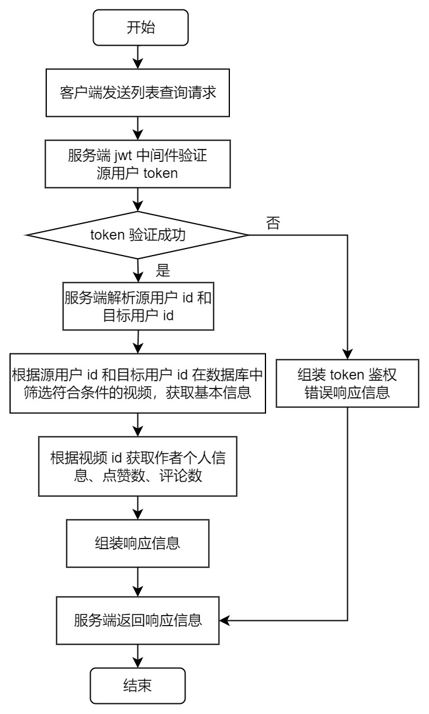
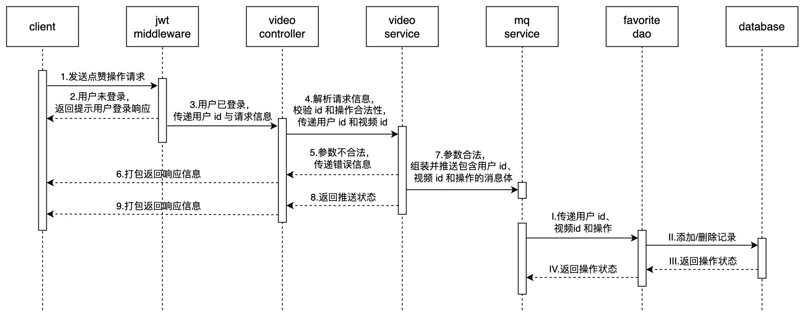

## 架构设计


## 接口设计

### 视频的获取与投稿

#### 视频feed流

##### 需求分析

- `/douyin/feed` - **视频流接口**

    不限制登录状态，返回按投稿时间倒序的视频列表，视频数由服务端控制，单次最多30个。

    ```go
    type (
    	FeedReq {
    		LastestTime string `form:"latest_time,optional"` // 可选参数，限制返回视频的最新投稿时间戳，精确到秒，不填表示当前时间
    		Token       string `form:"token,optional"` // 可选参数，登录用户设置
    	}
    	FeedRes {
    		StatusCode uint32      `json:"status_code"` // 状态码，0-成功，其他值-失败
    		StatusMsg  string      `json:"status_msg"` // 返回状态描述
    		NextTime   int64       `json:"next_time,omitempty"` // 本次返回的视频中，发布最早的时间，作为下次请求时的latest_time
            VideoList  interface{} `json:"video_list,omitempty"` // 视频列表, interface{} = FeedRes.Videos
    	}
    )
    ```

    ```protobuf
    message FeedReq{
        int64 latest_time=1;
        int64 user_id=2;
    }
    message FeedRes{
        uint32 status_code = 1;
        string status_msg = 2;
        repeated Video videos = 3;
        int64 next_time=4;
    }
    
    message Video{
        int64 id=1; // 视频唯一标识
        Profile user=2; // 视频作者信息
        string play_url=3; // 视频播放地址
        string cover_url=4; // 视频封面地址
        int64 favorite_count=5; // 视频的点赞总数
        int64 comment_count=6; // 视频的评论总数
        bool is_favorite=7; // true-已点赞，false-未点赞
        string title=8; // 视频标题
    }
    ```

##### 基本流程

未注册、未登录和已登录用户**均可获取**按发布时间倒序的视频流，每条视频包括视频 url、视频点赞数、视频评论数和作者个人信息。

未登录用户默认显示无点赞状态，已登录用户显示点赞状态。

1. 用户首次进入客户端，或在客户端首页刷新，客户端**向服务端发送拉取视频流请求**

2. 服务端接收请求，首先**对发起请求的用户信息进行鉴权**。

    ​	若未登录，则在数据库中筛选按发布时间倒序排列的 30 条视频基本信息，并基于基本信息从数据库中获取视频作者个人信息、视频点赞和评论信息，返回包含视频数据的响应信息

    ​	若已登录，则在数据库中筛选按发布时间倒序排列的 30 条视频基本信息，并基于基本信息从数据库中获取视频作者个人信息、视频点赞和评论信息、基于用户 ID 和视频 ID 在数据库和缓存中查询点赞状态，返回包含视频数据的响应信息

3. 客户端接收响应信息，在页面显示视频和基本信息


#### 视频投稿

##### 需求分析

- `/douyin/publish/action` - **视频投稿**

    登录用户选择视频上传。

    ```go
    type (
    	PublishReq {
    		Token string `form:"token"` // 用户鉴权token
            Data os.File `form:"data"` // 视频数据
    		Title string `form:"title"` // 视频标题
    	}
    	PublishRes {
    		StatusCode uint32 `json:"status_code"` // 状态码，0-成功，其他值-失败
    		StatusMsg  string `json:"status_msg"` // 返回状态描述
    	}
    )
    ```

##### 基本流程

已登录用户可以在客户端上传视频，包括视频元数据和视频标题等信息。

1. 用户在客户端上传视频页面选择视频和填写视频标题，点击上传按钮，客户端**向服务端发起视频上传请求**

2. 服务端接收请求，首先**对发起请求的用户信息进行鉴权**。

    ​	若未登录，则返回请先登录提示信息

    ​	若已登录，则基于用户 ID 和当前时间戳生成视频 ID，并将视频上传到对象存储数据库，生成视频封面上传到数据库中

3.  将视频真实 URL、封面真实 URL 等视频基本信息**数据插入数据库**中，**返回包含视频上传状态的响应信息**

4. 客户端接收响应信息，在页面显示视频和基本信息


#### 投稿列表

##### 需求分析

- `/douyin/publish/list` - **投稿列表**

    用户的视频发布列表，直接列出用户所有投稿过的视频

    ```go
    type (
    	GetPublishListReq {
    		Token  string `form:"token"`
    		UserId string `form:"user_id"`
    	}
    	GetPublishListRes {
    		StatusCode uint32      `json:"status_code"`
    		StatusMsg  string      `json:"status_msg"`
    		VideoList  interface{} `json:"video_list,omitempty"`
    	}
    )
    ```

    ```protobuf
    message GetPublishListReq{
        int64 src_user_id=1;
        int64 dst_user_id=2;
    }
    message GetPublishListRes{
        uint32 status_code = 1;
        string status_msg = 2;
        repeated Video videos = 3;
    }
    message Video{
        int64 id=1; // 视频唯一标识
        Profile user=2; // 视频作者信息
        string play_url=3; // 视频播放地址
        string cover_url=4; // 视频封面地址
        int64 favorite_count=5; // 视频的点赞总数
        int64 comment_count=6; // 视频的评论总数
        bool is_favorite=7; // true-已点赞，false-未点赞
        string title=8; // 视频标题
    }
    message Profile{
        int64 id=1; // 用户id
        string name=2; // 用户名称
        int64 follow_count=3; // 关注总数
        int64 follower_count=4; // 粉丝总数
        bool is_follow=5; // true-已关注，false-未关注
    }
    ```

##### 基本流程

已登录用户可以查看自己的投稿列表，也可以查看他人的投稿列表。

1. 用户点击客户端个人信息页面投稿列表栏目顶部按钮，客户端向服务端**发送列表查询请求**

2. 服务端接收请求，首先**对发起请求的用户信息进行鉴权**。

    ​	若未登录，则返回请先登录提示信息

    ​	若已登录，则在数据库和缓存中查询视频列表基本信息，并返回包含列表信息数据的响应信息

3. 客户端接收响应信息，在页面显示列表信息




### 视频点赞

#### 赞操作

##### 需求分析

- `/douyin/favorite/action` - **赞操作**

    登录用户对视频的点赞和取消点赞操作

    ```go
    type (
    	FavoriteReq {
    		Token      string `form:"token"` // 用户鉴权token
    		VideoId    string `form:"video_id"` // 视频id
    		ActionType string `form:"action_type"` // 1-点赞，2-取消点赞
    	}
    	FavoriteRes {
    		StatusCode uint32 `json:"status_code"` // 状态码，0-成功，其他值-失败
    		StatusMsg  string `json:"status_msg"` // 返回状态描述
    	}
    )
    ```

##### 基本流程

已登录用户可以对未点赞视频进行点赞操作，可以对已点赞视频进行取消点赞操作。

1. 用户点击视频点赞按钮，客户端向服务端**发起点赞或取消点赞操作请求**

2. 服务端接收请求，首先**对发起请求的用户信息进行鉴权**。

    ​	若未登录，则返回请先登录提示信息

    ​	若已登录，则校验源用户 ID 和目标用户 ID 合法性、关系操作合法性。

    ​		若不合法，则返回用户 ID 或关系操作不合法提示信息

    ​		若合法，则组装操作消息体**推送至消息队列**，并返回包含操作状态的响应信息

3. 消息队列的 consumer 不断取出操作消息体，在**查询数据库**得到历史记录后对当前操作的合法性进行校验。

    ​	若通过，则在数据库和缓存中添加当前操作的记录；

    ​	若未通过，则生成错误日志

4. 客户端接收响应信息，在页面切换组件状态




#### 点赞列表

##### 需求分析

- `/douyin/favorite/list` - **点赞列表**

    用户的所有点赞视频

    ```go
    type (
    	GetFavoriteListReq {
    		UserId string `form:"user_id"` // 用户id
    		Token  string `form:"token"` // 用户鉴权token
    	}
    	GetFavoriteListRes {
    		StatusCode uint32      `json:"status_code"` // 状态码，0-成功，其他值-失败
    		StatusMsg  string      `json:"status_msg"` // 返回状态描述
            VideoList  interface{} `json:"video_list,omitempty"` // 用户点赞视频列表, interface{} = GetfavoriteListRes.Videos
    	}
    )
    ```

    ```protobuf
    message GetFavoriteListReq{
        int64 src_user_id=1;
        int64 dst_user_id=2;
    }
    message GetFavoriteListRes{
        uint32 status_code = 1;
        string status_msg = 2;
        repeated Video videos = 3;
    }
    
    message Video{
        int64 id=1; // 视频唯一标识
        Profile user=2; // 视频作者信息
        string play_url=3; // 视频播放地址
        string cover_url=4; // 视频封面地址
        int64 favorite_count=5; // 视频的点赞总数
        int64 comment_count=6; // 视频的评论总数
        bool is_favorite=7; // true-已点赞，false-未点赞
        string title=8; // 视频标题
    }
    message Profile{
        int64 id=1; // 用户id
        string name=2; // 用户名称
        int64 follow_count=3; // 关注总数
        int64 follower_count=4; // 粉丝总数
        bool is_follow=5; // true-已关注，false-未关注
    }
    ```

##### 基本流程

**已登录用户**可以查看自己点赞的列表，也可以查看他人的点赞列表。

1. 用户点击客户端个人信息点赞列表栏目顶部按钮，客户端向服务端**发送列表查询请求**

2. 服务端接收请求，首先**对发起请求的用户信息进行鉴权**。

    ​	若未登录，则返回请先登录提示信息

    ​	若已登录，则在数据库和缓存中查询视频列表基本信息，并返回包含列表信息数据的响应信息

3. 客户端接收响应信息，在页面显示列表信息


### 视频评论

#### 评论操作

##### 需求分析

- `/douyin/comment/action` - **评论操作**

    登录用户对视频进行评论

    ```go
    type (
    	CommentReq {
    		Token       string `form:"token"` // 用户鉴权token
    		VideoId     string `form:"video_id"` // 视频id
    		ActionType  string `form:"action_type"` // 1-发布评论，2-删除评论
    		CommentText string `form:"comment_text,optional"` // 用户填写的评论内容，在action_type=1的时候使用
    		CommentId   string `form:"comment_id,optional"` // 要删除的评论id，在action_type=2的时候使用
    	}
    	CommentRes {
    		StatusCode uint32      `json:"status_code"` // 状态码，0-成功，其他值-失败
    		StatusMsg  string      `json:"status_msg"` // 返回状态描述
            Comment    interface{} `json:"comment,omitempty"` // 评论成功返回评论内容，不需要重新拉取整个列表, interface{} = CommentRes.Comment
    	}
    )
    ```

    ```protobuf
    message CommentReq{
        int64 user_id=1;
        int64 video_id=2;
        uint32 action_type=3;
        string comment_text=4;
        int64 comment_id=5;
    }
    message CommentRes{
        uint32 status_code = 1;
        string status_msg = 2;
        Comment comment = 3;
    }
    
    message Comment{
        int64 id=1; // 视频评论id
        Profile user=2; // 评论用户信息
        string content=3; // 评论内容
        string create_date=4; // 评论发布日期，格式 mm-dd
    }
    message Profile{
        int64 id=1; // 用户id
        string name=2; // 用户名称
        int64 follow_count=3; // 关注总数
        int64 follower_count=4; // 粉丝总数
        bool is_follow=5; // true-已关注，false-未关注
    }
    ```

##### 基本流程

**已登录用户**可以视频进行评论，可以对已发表的评论进行删除。

1. 用户在客户端视频评论页面中评论框内输入评论内容，**点击发表按钮**，客户端向服务端发送发表评论操作。

    用户在客户端视频评论页面中已发表的评论下方，**点击删除按钮**，客户端向服务端发送删除评论操作。

2. 服务端接收请求，首先**对发起请求的用户信息进行鉴权**。

    ​	若未登录，则返回请先登录提示信息

    若已登录，则校验用户 ID 和视频 ID 合法性、评论/删除评论操作合法性。

    ​	若不合法，则返回 ID 或评论操作不合法提示信息

    ​	若合法，则对评论内容进行敏感词过滤，生成过滤后新的评论内容

3. 结合 ID、操作和评论内容组装评论/删除评论消息体**推送至消息队列**，并返回包含操作状态的响应信息

4. 消息队列的 consumer 不断取出操作消息体，在数据库中进行操作

5. 客户端接收响应信息，页面显示评论内容或删除评论内容


#### 评论列表

##### 需求分析

- `/douyin/comment/list` - **视频评论列表**

    查看视频的所有评论，按发布时间倒序

    ```go
    type (
    	GetCommentListReq {
    		Token   string `form:"token"` // 用户鉴权token
    		VideoId string `form:"video_id"` // 视频id
    	}
    	GetCommentListRes {
    		StatusCode  uint32      `json:"status_code"` // 状态码，0-成功，其他值-失败
    		StatusMsg   string      `json:"status_msg"` // 返回状态描述
            CommentList interface{} `json:"comment_list,omitempty"` // 评论列表, interface{} = GetCommentListRes.Comments
    	}
    )
    ```

    ```protobuf
    message GetCommentListReq{
        int64 user_id=1;
        int64 video_id=2;
    }
    message GetCommentListRes{
        uint32 status_code = 1;
        string status_msg = 2;
        repeated Comment comments = 3;
    }
    
    message Comment{
        int64 id=1; // 视频评论id
        Profile user=2; // 评论用户信息
        string content=3; // 评论内容
        string create_date=4; // 评论发布日期，格式 mm-dd
    }
    message Profile{
        int64 id=1; // 用户id
        string name=2; // 用户名称
        int64 follow_count=3; // 关注总数
        int64 follower_count=4; // 粉丝总数
        bool is_follow=5; // true-已关注，false-未关注
    }
    ```

##### 基本流程

用户可以查看视频的评论列表。

1. 用户在客户端视频页面点击评论按钮展开评论列表，客户端向服务端**发送拉取评论列表请求**

2. 客户端接收请求，首先**校验用户 ID 和视频 ID 合法性**。

    ​	若不合法，则返回 ID 不合法提示信息

    ​	若合法，则在数据库中查询符合条件的评论

3. 调用用户服务**查询每条评论的个人信息**，并连同评论信息打包返回响应信息

4. 客户端接收响应，在页面显示评论列表内容


## 设计亮点

- **使用分布式对象存储平台**

    搭建 **Minio** 服务，将视频和封面图片推送至 **Minio**，MinIO用作云原生应用程序的主要存储，和传统对象存储相比，能够更高的吞吐量和更低的延迟

- **ffmpeg**

    使用**ffmpeg**获取视频封面图片，若用户上传的视频过大，会考虑将视频进行压缩处理

    ```go
    func PublishHandler(svcCtx *svc.ServiceContext) http.HandlerFunc {
        ...
    	err = ffmpeg.Input("-", ffmpeg.KwArgs{"loglevel": "debug"}).
    		Filter("select", ffmpeg.Args{"gte(n,1)"}).
    		Output("-", ffmpeg.KwArgs{"vframes": 1, "q:v": "2", "f": "image2"}).
    		OverWriteOutput().
    		WithOutput(imgBuffer).
    		WithErrorOutput(cmdOutput).
    		WithInput(videoBuffer).
    		WithTimeout(3 * time.Second).
    		Run()
    	if err != nil {
    		log.Logger.Error(crud.ErrGetVideoImage, zap.Error(errors.New(cmdOutput.String())))
    		httpx.WriteJson(
    			w,
    			http.StatusForbidden,
    			&types.PublishRes{
    				StatusCode: errx.Encode(
    					errx.Logic,
    					sys.SysId,
    					douyin.Api,
    					sys.ServiceIdApi,
    					consts.ErrIdLogicCrud,
    					crud.ErrIdOprPublish,
    					crud.ErrIdGetVideoImage,
    				),
    				StatusMsg: errx.Internal,
    			})
    		return
    	}
        ...
    }
    ```

- **并发优化拼接视频信息**

    处理逻辑基本上同 [](https://github.com/StellarisW/douyin/manifest/docs/user.md#L927) 一样

    ```go
    func (m *DefaultModel) getVideosInfo(ctx context.Context, srcUserId int64, videoSubjects []*entity.VideoSubject) ([]*pb.Video, errx.Error) {
    	videos := make([]*pb.Video, len(videoSubjects))
    
    	size := len(videoSubjects)
    
    	eg := new(errgroup.Group)
    
    	for i := 0; i < size; i++ {
    		i := i
            // 并发获取视频信息, 每一个视频id开启一个协程
    		eg.Go(func() error {
                // 协程里面再次开启多个协程用于拼接视频信息
    			wg := sync.WaitGroup{}
    
    			rpcRes := &userpb.GetProfileRes{}
    			
                // 获取用户信息
    			wg.Add(1)
    			go func() {
    				defer wg.Done()
    				rpcRes, _ = m.userSysRpcClient.GetProfile(ctx, &userpb.GetProfileReq{
    					SrcUserId: srcUserId,
    					DstUserId: videoSubjects[i].UserID,
    				})
    			}()
    
    			var favoriteCount, commentCount int64
    			var isFavorite bool
    			var erx errx.Error
    			
                // 获取视频点赞数, 评论数, 是否点赞
    			wg.Add(1)
    			go func() {
    				defer wg.Done()
    				cmds, err := m.rdb.Pipelined(ctx, func(pipe redis.Pipeliner) error {
    					pipe.Get(ctx,
    						fmt.Sprintf("%s%d", video.RdbKeyFavoriteCnt, videoSubjects[i].ID),
    					)
    
    					pipe.Get(ctx,
    						fmt.Sprintf("%s%d", video.RdbKeyCommentCnt, videoSubjects[i].ID),
    					)
    
    					pipe.ZRank(ctx,
    						fmt.Sprintf("%s%d", video.RdbKeyFavorite, srcUserId), strconv.FormatInt(videoSubjects[i].ID, 10),
    					)
    
    					return nil
    				})
    				if err != nil {
    					if err != redis.Nil {
    						log.Logger.Error(errx.RedisPipeExec, zap.Error(err))
    						erx = errRedisPipeExec
    						return
    					}
    				}
    
    				favoriteCount, err = cmds[0].(*redis.StringCmd).Int64()
    				if err != nil {
    					if err != redis.Nil {
    						log.Logger.Error(errx.RedisGet, zap.Error(err))
    						erx = errRedisGet
    						return
    					}
    				}
    
    				commentCount, err = cmds[1].(*redis.StringCmd).Int64()
    				if err != nil {
    					if err != redis.Nil {
    						log.Logger.Error(errx.RedisGet, zap.Error(err))
    						erx = errRedisGet
    						return
    					}
    				}
    
    				_, err = cmds[2].(*redis.IntCmd).Result()
    				if err != nil {
    					if err != redis.Nil {
    						log.Logger.Error(errx.RedisGet, zap.Error(err))
    						erx = errRedisGet
    						return
    					}
    				} else {
    					isFavorite = true
    				}
    			}()
    
    			wg.Wait()
    
    			if rpcRes == nil {
    				log.Logger.Error(errx.RequestRpcReceive)
    				return errRequestRpcReceive
    			}
    			if rpcRes.StatusCode != 0 {
    				log.Logger.Error(errx.RequestRpcRes)
    				return errRequestRpcRes
    			}
    
    			if erx != nil {
    				return erx
    			}
    
    			videos[i] = &pb.Video{
    				Id: videoSubjects[i].ID,
    				User: &pb.Profile{
    					Id:            videoSubjects[i].UserID,
    					Name:          rpcRes.User.Name,
    					FollowCount:   rpcRes.User.FollowCount,
    					FollowerCount: rpcRes.User.FollowerCount,
    					IsFollow:      rpcRes.User.IsFollow,
    				},
    				PlayUrl:       videoSubjects[i].PlayURL,
    				CoverUrl:      videoSubjects[i].CoverURL,
    				FavoriteCount: favoriteCount,
    				CommentCount:  commentCount,
    				IsFavorite:    isFavorite,
    				Title:         videoSubjects[i].Title,
    			}
    
    			return nil
    		})
    	}
    
    	if err := eg.Wait(); err != nil {
    		return nil, errx.New(errx.GetCode(err), err.Error())
    	}
    
    	return videos, nil
    }
    ```

- **视频点赞和评论操作使用消息队列**

- **评论信息过滤**

    使用 **DFA** 算法进行过滤不良信息，会将敏感词替换为 '*'，具体算法实现看我的仓库 [go-sensitive](https://github.com/StellarisW/go-sensitive)

    ```go
    func (l *CommentLogic) Comment(req *types.CommentReq) (resp *types.CommentRes, err error) {
    	...
    	err = video.Comment(producer, video.CommentMessage{
    		UserId:      userId,
    		VideoId:     videoId,
    		ActionType:  uint32(actionType),
    		CommentText: l.svcCtx.Filter.GetFilter().Replace(req.CommentText, '*'),
    		CommentId:   commentId,
    	})
        ...
    }
    ```